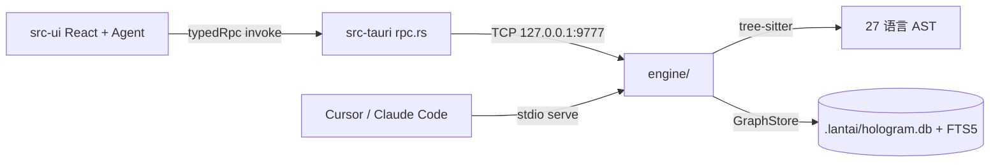

# 兰台（Lantai）— Agent 项目手册

> ## ⚡ 破坏性操作授权（最高优先级，2026-08-25 用户拍板）
>
> ### 授权（行为面——以下全部明文允许，无需再问）
>
> **用户允许 Agent 对代码库进行重构、清理、架构整理等破坏性操作，一切由测试工程兜底，以结果论对错。**
> 具体放宽（未尽事项按此精神类推）：
>
> 1. **删代码、删文件、删模块**：不合理的行为、死代码、过时抽象——直接删，不留注释尸体，不写「deprecated 保留一个版本」。
> 2. **改公开行为**：函数签名、参数、返回形状、RPC 契约、存储格式——发现不合理的直接改，不造兼容层、不写双读、不搞渐进迁移（除非用户明确要求保留过渡期）。
> 3. **改架构**：移动文件、拆分/合并模块、重画层边界、删除整层——按目标架构直接落位，git mv 保历史即可，不因「动静太大」而绕行。
> 4. **改数据约定**：旧数据不迁移、直接归档（.bak 挪位、代码永不回读）是被认可的标准操作；旧格式读不进来就让它不存在。
> 5. **推翻 Agent 自己之前的方案**：上一轮做错了就整段撤销重做（撤销预留-领取制是先例），不为沉没成本辩护。
> 6. **连带清理**：修 A 时发现 B 也是同类病灶，允许顺手把 B 一并拆掉（测试同步更新），不必为「最小 diff」原则留下病灶。
>
> **判定原则：发现旧的不合理行为，默认拆除而非兼容；兼容层只在用户明确要求时建；拆干净比绕着走重要。**
>
> ### 铁律（测试面——授权的边界，一条不可协商）
>
> **一切破坏性操作由测试工程兜底：**
> 1. **动刀前**：受影响面的测试先跑一遍，确认基线状态（绿/红都要知道）。
> 2. **动刀中**：删除行为时同步删除/改写为它服务的测试；测试不许为旧行为陪葬，也不许假装没看见。
> 3. **动刀后**：对应验证门禁必须全绿才允许 commit（engine/storage/vector/graph：`cargo test`；src-ui：`vitest` + `build` + `biome ci` 0/0；组合层：`verify:convergence`）。门禁红着就是没改完，不许「先 commit 以后修」。
> 4. **行为变更**：用户可感知的行为变了（哪怕变对了），在 commit message 里写清楚变了什么——结果论对错的前提是结果可查。
> 5. **测试改造禁令（2026-09-04 立规）**：重构之下测试只有三种命运——行为未变→零改动（黄金标准：换轨 commit 的测试 diff 为零 = 行为零漂移的最强证据）；行为退役→同批删除；行为新增→从用户操作序列新写。**禁止第四种「改造后放回原位」**——被改造的测试考官与考生同为一人，绿灯作证力归零，旧实现形状（mock/setup/参数形状）随改造续命成化石床。故意规格变更必须显式声明（走 baseline-change-request 等审批通道），不偷跑。验收重构 commit 先看测试 diff 形状：理想 = 大片零改动 + 少量整删整增；大片小改 = 嫌疑必查。
>
> 背景：LLM 的天性是保守兼容（读旧代码后本能往上堆、兼容旧行为/参数/存储），本项目的历史包袱（铺卷化石等三轮「重构」都绕着旧时序走）正是破坏性操作干得不彻底留下的。本条款反转该默认值：**在此仓库，破坏性操作是常态，保守兼容才需要理由。**

> 生成：2026-06-18 · 更新：2026-08-22（**产品更名**：应用名 兰台 / Lantai，identifier `com.lantai.app`；**HoloGram 降级为图谱引擎专名保留**——工具域 `hologram(...)`、MCP 工具 `hologram_*`、`.lantai/` 数据目录、`HOLOGRAM_*` env、`hologram.db` 均属引擎命名空间不改。更名史见 `docs/plans/HISTORY.md`）
> 本文件是项目级静态注入文档：Codex 读 `AGENTS.md`，Claude Code 读 `CLAUDE.md`，内置兰台 Agent 把 `CLAUDE.md` 注入 system prompt。
> **编码规则不是本文件的正文，而是 `CONVENTIONS.md` + `INVARIANTS.md`；本文件负责让规则真正被执行。**

## 0. 开工前强制加载（不可跳过）

1. 先读根目录 `CONVENTIONS.md`（当前编码约定，以代码现状为准）。
2. 涉及 `src-ui/src/ui/**`、`src-ui/src/agent/**` 或 Rust 接缝时，读 `INVARIANTS.md`（已炸过的雷）。
3. 规则优先级：`docs/adr/project-constitution.md`（四条架构约定）> `INVARIANTS.md` > `CONVENTIONS.md` > 本文件 > 历史 plan/handoff。
4. 改高 fan-in 文件前先问图（内置 Agent：`graph(preflight|impact)`；外部 MCP：`preflight_check` / `trace_impact`）。
5. 规则与代码现状冲突时：以代码为准，更新规则文档，不要盲改；无法判断就停下来问用户。

## 1. 一句话

把代码库变成可对话的 3D 依赖星图，并内置多 Agent 编码工作台——用确定性的图查询替代 LLM 逐文件猜源码。

## 2. 目录结构（当前实际）

```
HoloGram/（根 Cargo.toml = workspace，五成员）
├── hologram-graph/    图类型层独立 crate（L5b）：Node/Edge/Graph + ID 全局驻留器；
│                      零项目内依赖；engine 的 code_extension_set 后缀表经
│                      set_code_extensions 注入（未注入退化通用默认表）；
│                      ignore.rs = 通用排除规则（is_ignored_path 等，engine 与壳共用）
├── hologram-vector/   向量检索层独立 crate（L5b）：usearch 索引 + MiniLM ONNX 嵌入；
│                      纯计算，依赖 graph；vectors.usearch 数据文件归属仍在宿主
├── hologram-storage/  数据家层独立 crate（L5b）：GraphStore/MemoryIndex/SqliteDb/
│                      快照 + StoreHost 所有权单元；依赖 graph+vector，不依赖 engine
├── engine/            Rust 分析引擎（27 静态 tree-sitter 语法；36 默认 MCP 工具 / 38 schema；
│                      Phase 3 竣工：壳内嵌消费已退役，引擎唯一运行时实体 = 独立进程
│                      `hologram-engine.exe serve`（每工作区一个，stdio MCP；11 个壳专属
│                      hidden 方法 = 壳 host API，见 contract.rs v4）；L2 存储外置 + L5b
│                      crate 化：storage/vector/graph 三门面再导出保持内部路径零改动；
│                      StoreHost 由引擎自开，壳侧另开同库并发；Engine 单根实例可多开；
│                      incremental.rs 归 pipeline/）。免编译扩展面（Phase 4）：
│                      src/plugins/ 读 HOLOGRAM_PLUGIN_DIR（缺省 <root>/plugins）manifest，
│                      声明 language/framework/tool 三类扩展（示例 examples/engine-plugins/，
│                      契约与失败语义见 engine/src/plugins/mod.rs 头注 + engine_status.extensions）
├── src-tauri/         Tauri 2 桌面壳（rpc.rs 单一 IPC 入口 + 权限沙箱 + app/ 应用层 + 命令薄壳）
│   ├── src/app/       应用层（L1 分层重构）：WorkspaceDataContext 按工作区实例化
│   │                  （每工作区一个进程外引擎传输；决议链：显式 path → 活动单槽）
│   ├── src/commands/  RPC 命令薄壳（业务在 app/services/；横切权限/进程留壳）
├── src-ui/            TypeScript 前端（React 19 + Three.js + Monaco + Zustand 5）
│   ├── src/app/       新观测台壳（单 React 根；新 UI 落这里）
│   ├── src/state/     zustand 状态层（领域 store + 面板/app 级 store + 信号 store）
│   ├── src/scene/     星图类型层（C13 sweep 后仅存 graph-types.ts；渲染面已退役）
│   ├── src/ui/        chat 编排域核心 + 旧层命令式基础设施（终态 25 文件，见目录 README）
│   ├── src/cordis/    vendored cordis 内核（Context/Fiber/Service；禁就地改，见目录 README）
│   ├── src/composition/ 组合层（S1+V3b+P4+平台化 Phase 1/2）：工具行表 tool-rows + prompt section 表 + 贡献通道 service 注册表（四 service + V3b 块渲染器 renderer-service + P4 A-1 prompt 段 prompt-service + P4 A-2/3 hooks/capabilities + Phase 1 llm/subagents + Phase 2 fs/shell/sessionPersistence/graph）
│   └── src/agent/     Agent 运行时、工具层、多 Agent、goal/plan
├── docs/              架构/ADR/交接/研究；archive/ 是历史，勿作现状依据
├── assets/            图标、UI 原型
├── CLAUDE.md          内置 Agent 系统提示 + Claude Code 项目指令
├── AGENTS.md          本文件（Codex/OpenAI 静态注入）
├── CONVENTIONS.md     编码约定（开工前必读）
├── INVARIANTS.md      踩碎必炸的雷（改动前必读）
├── CONTEXT.md         应用级统一词汇（kind/status 重载字段带簇前缀）
└── ARCHITECTURE.md    系统架构总览
```

> 壳层禁直连任何引擎族 crate（hologram-graph/storage/vector/engine 依赖全摘，
> 2026-09-08 逻辑全断）——引擎消费一律走 `engine_transport`（stdio MCP）；
> 文件忽略语义壳内自有 `ignored_paths.rs`。守卫测试
> `shell_has_zero_hologram_crate_refs` 钉死，src-tauri/src/app/mod.rs。

> `tests/` 根目录已不存在（旧 Python 测试已随引擎 Rust 化移除），不要以旧文档里的 `tests/` 路径为准。

### `.lantai/` 运行时目录

```
.lantai/
├── agents/{agentId}/             Agent 会话槽 + inbox.json（JsonMessageStore）
├── taskboard/{sessionId}.json    会话级 TaskBoard
├── discoveries/{sessionId}.json  会话级 DiscoveryBoard
├── goals/{id}/                   Goal 状态（goal.json/session.json/index.json）
├── permissions.json              项目级权限规则
├── hologram.db + FTS5            图存储/全文索引
├── baseline.json                 约束基线
├── audit.jsonl                   审计日志
├── vectors.slots.json / vectors.usearch   语义向量索引
└── logs/                         运行日志
```

## 3. 数据流



## 4. 引擎能力与工具面（2026-08-17 实测）

- **语言**：27 种 tree-sitter 语法静态链接；18 族适配器有专用结构查询（`.scm`，`engine/queries/` 共 38 个查询文件），其余静态语言走通用兜底；JSON 语法在代码中禁用（数据文件不解析）；Kotlin / Markdown / TOML 动态加载。
- **引擎 MCP 工具**：38 个 schema，默认激活 36 个（`symbol_history` 为 legacy 不默认激活；另 11 个壳专属 hidden 方法 = 壳 host API，永不进模型 `tools/list`，真源 `contract.rs` v3；`HOLOGRAM_MCP_TOOLS=*` 放开全量）。外部 MCP 客户端（Cursor/Claude Code）仍见细粒度工具名。
- **内置 Agent 领域工具**：模型可见工具面清单/枚举/参数以生成物为唯一事实源——
  `docs/agents/model-tool-contract.md`（`scripts/gen-tool-contract-md.cjs` 从 ToolRegistry
  装配产物生成，勿手改；变更后重新生成并同 commit，vitest 守护测试对拍漂移）。
  常驻 `ask_user / Skill / wait / enter_plan_mode / exit_plan_mode` 中 ask_user/wait 在注册表面内，
  其余为 blueprint 会话级装配。P2/P3（2026-08-23）：执行原语 `code_execution` 落地（blueprint
  capability `code-execution-tool`；经 ctx.codeRuntime 服务运行——vendored cordis Service，
  agent/code-run/ 四件：protocol 腰线 / bootstrap worker 源 / host 敌意校验+预算 / 工具本体；
  程序内 `await tools.<name>(args)` 嵌套调全部可见工具，子分发逐条落 session-log
  `tool/code-dispatch-start|code-dispatch` 审计对，门禁不豁免）。S3（2026-08-22）：settings 面板域经第一方插件贡献
  （`plugins/settings-plugin.ts` 面板 + 命令双通道；paper 同步补齐 `paper/toggle`）——
  `PANEL_DEFS` 常量面清空，快捷键链路经 `app/actions.ts` 别名翻译层
  （`ACTION_CONTRIBUTION_ALIASES`）桥接到域贡献 id，useGlobalKeys 字面量不变。
  - `graph`：symbols / semantic（语义检索——向量索引按含义找符号，不知确切名字时用）/ neighbors / impact / preflight / cycles / coupling / fragile / flows / dataflow / dataflow_save / dataflow_query 等 27 个动作（dataflow_save 为写动作）——**改代码前先问图**。
  - `ops`：analyze / validate / health / status / timeline / rename / import_scip。
  - `lsp`：resolve_call / infer_type / implementations / references。
  - `fs`：read / write / edit / list / glob / mkdir / move / rename / delete / constraints（读）/ write_constraints（写 hologram.constraints.yaml——补齐 check_boundaries 发现违规后的规则固化闭环）。
  - `browser` / `desktop`（2026-08 computer-use 改造）：desktop 为进程内 UIA COM（`src-tauri/src/uia/` 专用线程 + 树缓存），写动作返回 world-diff；权限分层=窗口接管 Ask 一次 + 敏感目标/物理输入单独 Ask + 全局输入租约（`INVARIANTS.md` 物理输入铁律）；`desktop(probe)` 每窗口带 cdp/uia/vision 通道路由建议；desktop 写动作全量审计（`desktop(audit)` 可查）；敏感词表在 `src-tauri/src/sensitive.rs`（browser/desktop 共享单一事实源）。
  - 旧细粒度名（`search_symbols`、`run_shell`、`write_file`、`git_*`、`agent_spawn` 等）保留但 `hide()`；模型调用会被 `retireRedirect` 拦截并给 `[已淘汰]` 重定向。内部代码/测试仍可直接用旧名。

## 5. 快速操作（Agent 视角）

| 任务 | 命令/工具 |
|---|---|
| 探索代码结构 | 内置 `graph(symbols|explore|neighbors)`；外部 MCP `explore_deps` / `search_symbols` |
| 改文件前影响面 | 内置 `graph(action:'preflight', path:[...])`；外部 MCP `preflight_check` |
| 高风险模块 | `graph(fragile)` / `graph(cycles)` / `graph(blindspots)` |
| 改引擎 | `cd engine && cargo test`（快验 `cargo build`） |
| 改前端 | `cd src-ui && npm run build` + `npx vitest run` |
| 改壳 | `cd src-tauri && cargo test`（快验 `cargo check`） |
| 桌面打包 | `cd src-tauri && cargo tauri build`（自动先跑前端构建 + `cargo build -p hologram-engine --release`——壳不依赖引擎 crate，引擎二进制全靠这一步产出；bundle 落 exe 同级） |
| 前端格式 | `cd src-ui && npx biome check --write <改动文件>` |

## 6. 前端分层铁律（详情见 CONVENTIONS.md）

- UI 状态走 zustand store，事件总线已归零（2026-08-19 `docs/archive/eventbus-zero-and-ui-split-plan.md` P0-P3 竣工）：`ui/events.ts` 整文件删除（EventBus/bus/BusEvents 不存在了，禁复活——不要 window.dispatchEvent / CustomEvent / 自建 EventEmitter）；原 11 事件全迁 zustand 信号 store。ui/ 拆分终态：store 一律 `src/state/`（领域 + 面板 + app 级 + 信号 store）、`src/scene/` 仅存星图类型模块 graph-types.ts（C13 sweep 2026-08-22：Three.js 渲染面 22 文件删除，`ui/graph.ts` shim 重指向类型模块，冻结文件 chat-stream 的 type import 走此层不变）、`ui/` 残余 = chat 编排域核心 + 旧层命令式基础设施（见 `src/ui/README.md`）。终态守护 `tests/eventbus-zero-and-ui-split.test.ts` 与 `tests/ui-react-retirement.test.ts`。
- 面板级状态用 `createScopedStore` 注册表（`state/` 的 messages/session/panel/input 四件套，聚合入口 `ui/chat-store.ts`）；app 级单例用 `app/shell-store` / `state/dock-store`。
- 聊天消息原地 mutate 后必须 `touchMessage / touchMessageContaining`——裸 `bump()` 或展开数组会静默卡 UI（`INVARIANTS #1/#2/#3`）。
- 冻结文件：`ui/chat-session.ts`、`ui/chat-stream.ts`、`ui/part-mutator.ts`、`agent/execution-state.ts`。
- 样式只写 `--obs-*` token；不引入新 CSS 方案；DOM 所有权按层划分（React UI 不自建游离 DOM，星图 scene / Monaco 宿主是既有 imperative-DOM 所有者）。
- 工作区级资源两原语（详情 CONVENTIONS.md §1.10 + INVARIANTS #12；2026-08-18 cordis-migration P1 起登记原语为 fiber effect）：**获取必须以 `Workspace._fiber.ctx.effect(() => disposer, 'label')` 登记**（setupAgent 顺序敏感组打包 DisposerBag 作单个 effect）；**跨工作区 fire-and-forget 写共享态必须 `getWorkspaceEpoch()/isCurrentEpoch()` 校验**。deactivate/forceClearState 只调 `fiber.dispose()` + `bumpWorkspaceEpoch()`；P3 起子系统服务化样板 = `ui/lsp-client.ts` LspService（状态收进 Service 挂工作区 fiber，模块函数薄转发保消费面）。

## 7. RPC 与工具契约（详情见 CONVENTIONS.md + INVARIANTS #7-#10）

- 前端一律 `typedRpc / typedListen`（`src-ui/src/rpc-contract.ts`），参数键 snake_case，返回 string（JSON 用 `parseJson`）。裸 `rpc` 只允许两个受权出口：`rpc-contract.ts` 与 `agent/tool.ts`，biome 禁新增。
- 新增模型工具必须 `defineTool` + zod v4：一个 schema 产出 JSON Schema / 运行时校验 / 类型化参数。内部 `.passthrough()` 透传 meta key；`_forceGate` 要声明、`_callId/_agent_id` 不声明。
- 工具 execute 必须全量透传 args——重建参数对象会丢掉 `_agent_id`，fork 子 Agent 会直写主仓（2026-08-13 事故）。
- 新增领域动作同步 `tools/domains.ts` 的 `DOMAIN_SPECS` + `collectHiddenToolNames()` + 对应测试 + 本文件。引擎侧新增 MCP 工具必须同时接进 `DOMAIN_SPECS`（graph/ops/lsp）——`tests/engine-tool-surface.test.ts` 钉住「引擎默认清单 ↔ 领域映射 ↔ mock 清单」三层对齐，漏接会红。
- Agent 装配（组合架构 S1 三层 + S2 外化 + S4 preset realm/热重载/安装通道，2026-08-20 起）：**内置工具族**（①c 后仅 web/browser-desktop 2 行——十二族已迁插件通道）加行到 `src/composition/tool-rows.ts` 行表（factory → Tool[]，行内重名装载期拒绝）；**第一方工具域插件**（P4 B① git/search + ② fs/shell/agent-isolation 无状态五族 + ①c wait/ask/memory/skill/task/agent/hologram 装配期真值七族，2026-08-23）经 `ctx.tools` 贡献通道注册（`plugins/builtin/<domain>/`，清单单一真源 `composition/first-party-tools.ts`，loader 表尾装载；无状态族走实例缓存，装配期真值族声明贡献 noCache 每装配重创——holoExec/ui 回调/subAgentPool/graphData 开关直收当次 rowCtx）；**system-prompt 段落**（persona/规则/记忆/运行环境）定义留 `src/composition/prompt-sections.ts` 单一真源（id + applicable + render，分隔符是字节契约禁规整；P4 B④ 收官起 13 段全量经 `plugins/builtin/prompt-segments.ts` 装载 `firstPartyPromptSections()` 走 ctx.prompts 通道贡献，出厂段表退役）；**插件 prompt 段贡献**（P4 A-1 起）经 `ctx.prompts` 通道注册（`composition/prompt-service.ts`）；**S4-4 甲（2026-08-23）组合解析域收编通道贡献**——`factoryComposition()` 快照 pluginToolRows 行（builtin 行在前、贡献行随后）+ ctx.prompts 段贡献，patch/preset 可寻址 `plugin/<贡献 id>` 行与贡献段 id（含 13 第一方段；B④/② 的寻址拒绝与两条临时位序消灭）；**平台化 P3（2026-08-27）seam 裁剪域**——`factoryComposition()` 收编七条 `seam/<域>` 寻址域（llm/subagents/fs/shell/sessionPersistence/graph/loopEvents），patch/preset 可禁用 provider、开关 emit 观测事件（消费视图 = 活动注册表 − 禁用集，过滤收在 active* 消费单点与 emitLoopEvent；生成器 `gen-service-catalog`/`gen-event-catalog` + `doc-sync` 门禁 + 开放面契约版本 `composition/contract-version.ts`；详见 `docs/composition/README.md` §seam 裁剪域）；**平台化 P4（2026-08-27）运行时插件全链路**——D6 外部插件装/卸/启用/禁用**运行时生效**（loader 活跃注册表 + activate/deactivateExternalPlugin，fiber dispose 链式回收）；D7 `ctx.dynamicRunner`（agent/dynamic-runner/）——模型经 **cordis 域**（define/run/stop/undefine/inspect_list/inspect_self，形状对齐 DSH tool-cordis）运行时定义插件包：approval 门（首激活 UI 批准，拒绝终局）+ 宿主半沙箱（危险全局阴影 / 守卫注册面 / 预算，见 `agent/dynamic-runner/sandbox.ts` 三层防线）+ 包不可变/失败回滚/会话所有权隔离；进程外能力面收口 = `examples/plugins/dataflow-mcp/`（外部 MCP server 承载真实能力端到端例子，`./` 前缀 args 相对插件目录解析）；信任模型 v1（静态完全信任 = 已知债 + 动态 approval+沙箱）见 `docs/plugins/README.md` §6；**平台化 P5（2026-08-28）存量迁移**——D13 `ctx.agentLoop`（agent/agent-loop/：`AgentLoop`/`AgentLoopHost` 契约 + `builtin/default` 默认实现 + 注册表后注册胜）——流式循环降为第一方默认实现（Agent.runLoop 委托，行为逐字节一致）；工具管道生产路径统一切 eventBus（构造期 attachPlanGate + setHooks/setPreflightHooks 各自一次性 attach；executor 收 bus 优先、legacy 直调忽略——差分 trace fixture 钉住等价）；第一方 loop 可观测监听器 `agent/agent-loop/observability.ts`（turn/start 监听化，建新拆旧；其余散点清单化于 event-feature-map）；P5-C1/C2 守卫测试 `first-party-surface.test.ts` + `agent-loop-seam.test.ts`；**平台化 P6（2026-08-28）平台税收口**——插件面人类契约 = `docs/plugins/README.md`（§0 平台契约总览：贡献通道/seam provider 表/运行时插件三形态/契约版本/信任模型二分）；各 seam cookbook = `docs/cookbook/`（llm/subagents/fs/shell/session/graph 后端 + 动态插件 + MCP server）；三方发布路径 = `docs/user/develop/publishing-plugins.md`；跨 seam 替换集成 = `tests/cross-seam-swap.test.ts`；`assembleSystemPrompt` sections 提供即精确清单、缺省 = 当前贡献；贡献 register/dispose = 组合输入变更（preset-assembly cache 代数失效 + bootShell 贡献监听 reapplyComposition）；**会话级工具/hook**（plan/通信/discovery/merge/board/kill/request/spawn/task/compaction/converge）加项到 `agent/blueprint.ts` capability 表，不改 `AgentConfig`（冻结 31 字段）。三层表序 = 字节契约（前缀缓存 + effective 快照依赖此序）；capability 只做组合，teardown 走 `ctx.effect`。面板/命令/工具/llm/子代理/块渲染器/prompt 段等贡献通道 service 注册表挂根 Context（`src/composition/services.ts` 四件 + V3b `renderer-service.tsx` 块渲染器——纸壳块体渲染经 `resolveRenderer(kind)` 解析，后注册胜 + P4 A-1 `prompt-service.ts` prompt 段）；**S4 起消费闭环已接线**——面板清单 = `panelDefs()`（常量 + ctx.panels 贡献）、命令面板合流 ctx.commands 折算、插件工具经 `composition/plugin-tool-rows.ts` 折算（行 id `plugin/<贡献 id>`）进组合解析域后由 buildToolRegistry 单一循环统一装配（面板/命令即时生效、工具与 prompt 段下次装配生效）。**preset realm**：`composition/presets.ts` 内置表（standard/minimal）+ `preset-discovery.ts` 用户目录（`~/.lantai/composition/presets/<id>/`）+ `preset-assembly.ts`（resolveCurrentComposition 引用稳定 cache + settings↔store 选择同步）；层序 factory → 用户层 → preset；装配面可选 composition 覆盖参数（`createAgentFromContext` 第 4 参 / `createAgent` 第 2 参，缺省 = S2 零漂移）；子 Agent 经 ctx composition 服务继承。**热重载**：Rust composition_watcher → `composition:changed` → `reloadCompositionPatch`（根级 patch 保存即新装配生效；在途会话冻结）。**插件安装通道**：`plugin_install`/`plugin_uninstall`/`plugin_set_enabled`/`plugin_dir`（S4-4 乙：机器桥的 stdio command 插件目录锚点）RPC + 设置面板「插件」tab；**MCP 机器桥（S4-4 乙，2026-08-23）**：manifest `mcpServers` 声明式挂接外部 MCP server——一个 server 一条工具贡献（行 id `plugin/<插件名>/mcp/<server名>` 进寻址域），lazy（缺省，空集不缓存/装配期重试）| startup-error（装载期急连接）双失败策略，stdio 经 Rust protocol_bridge（command 相对插件目录解析）/ http 直连，进程 kill 挂插件 fiber disposer（`plugins/mcp-bridge.ts`）；插件必须自包含（无裸 import——宿主桥 `window.__lantai_plugin_host__` 提供 createElement/notify；写法范本 `examples/plugins/hello/`；插件面人类契约 `docs/plugins/README.md`）。**S2 起用户层 patch**（`~/.lantai/composition/roster.patch.yml`，经 `composition/roster.ts` 的 `resolveRoster` 解析）可禁用/覆盖/插入四域行寻址域 = builtin 行表 + 通道贡献快照——S4-4 甲起 plugin 贡献行/段可寻址禁用/覆盖/锚定）——改 roster 引擎/patch 语义必读 `docs/composition/README.md`；**10 壳行**（`composition/shell-rows.ts` 表 + `src/shell/rows/*` 实现 + `src/shell/boot.ts` 编排器）承载 main.ts 引导职责，新引导接线加壳行不是往 main.ts 堆代码。
- **第一方插件清单身份（2026-08-29 立账；2026-09-03 S5 竣工后 44 个 = 14 内核 + 30 出厂产物）**：`plugins/first-party-manifest.ts` 是第一方插件身份单一真源（name → version/description/kind；kind 降级为展示分组标签——`service` = 内核插件不提供禁用开关，`feature` = 出厂产物可禁用）。设置面板「插件」tab 三组陈列：平台服务 / 内置插件 / 已安装（第三方）。feature 类启用/禁用经 `state/plugin-prefs.ts`（localStorage 持久化）**下次启动生效**；装载结果统一收 `state/plugin-store.ts`。**S5（2026-09-03）：BUILTIN_PLUGINS 只装 14 内核；30 出厂产物真源在 `plugins/builtin/<name>/` 目录（磁盘通道装载，改插件 = 换产物不重编译 exe）；dev 模式经 `plugins/factory-products.ts` 的 import.meta.env.DEV 分支走源码路径（vite HMR）；装载调度 = cordis fiber PENDING 挂起 + `plugins/boot-gate.ts` 全 ACTIVE 审计 fail-loud**。**新增出厂产物 = 产品目录建 index.ts + manifest.json + factory-products.ts 加行 + 本清单加条目**（守护 `tests/first-party-manifest.test.ts`）。
- session 变异（Phase 5 立规）：只走 `_appendMessage / _replaceSession / _retractSessionRange` 三入口（spec AST 白名单 + gate 计数双层门禁）；改工具折叠逻辑必须同步 `session-log.ts` 的 `derivePayload`。
- 改 `src-ui/src/agent/**` 或 `src-ui/src/composition/**` 必过 `npm run verify:convergence`（T0 静态 + 8 baseline 对拍；不设 `CONVERGENCE_PRESET` 直接跑——standard 快照逐字节零漂移是组合层的硬门禁）；record 永不上 CI，baseline 变更走 `docs/archive/agent-core-convergence/baseline-change-request.md` 审批。
- 新增 RPC：`src-tauri/src/rpc.rs` 分支 + 前端 `RpcContract`；`docs/agents/frontend-rpc-contract.md` 由 `scripts/gen-rpc-contract-md.cjs` 生成，勿手改。
- **工具业务一律走内核插件运行时（kernel-plugin-runtime，2026-09-03 起）**：新工具 = `src-tauri/src/tool_plugins/<name>/`（manifest.json + ToolPlugin 实现）+ `tool_call` 统一入口，不再新增细粒度 RPC 分支；前端工具面从 manifest 生成（`agent/tools/manifest-tools.ts` + `npm run gen:plugin-manifests` 镜像，doc-sync 门禁）。契约与阶段见 `docs/plans/kernel-plugin-runtime-plan.md`。

## 8. 多 Agent 并发纪律（事故报告：docs/agents/platform-bugs-2026-08-13.md）

- 子 Agent 注册表必须 `convergeRegistry(subTools)` 重建领域工具；克隆来的 `fs/shell` 闭包绑父注册表，不重建会绕过所有权包装、构建禁令、plan 只读。
- 文件所有权（`file-ownership.ts`）覆盖 fresh 与隔离降级的 fork；claim 键斜杠归一。
- merge 据实三原则：无产出不报 ✅；清理失败 ≠ 合并失败；冲突保留 worktree（diff 有 32KB 截断，worktree 是全量现场）。`agent(merge)` 进程内串行。
- `edit_file` 并发安全在 Rust 临界区（`editor.rs checked_write_atomic`：进程级锁 + fail-closed 重读校验）；TS 侧不得假设「返回成功 = 落盘」之外的时序。
- TTL 清理不得销毁无记录的工作：discard 前抓 diff 回 board，抓不到保留现场并通知父 Agent。
- 模型可见子 Agent ID `sub-{timestamp}-{random}`；worktree ID `agent-{timestamp}-{random}`；池内部 ID 不暴露给模型。

## 9. Goal / Plan 模式要点

- `/goal`：`goal-manager.ts` 驱动 `Agent._goalLoop`；状态在 `.lantai/goals/{id}/`，与普通聊天槽隔离；完成靠 `goal_report` 工具，`[GOAL_COMPLETE]` 只是旧会话 fallback。
- Plan 模式：工具 schema 跨模式恒定（保护 DeepSeek 前缀缓存）；写约束由 `planGate` 在执行层拦截。只读动作放行，fs write/edit 计划文件豁免，agent spawn 豁免；plan 中 spawn 的子 Agent 静态只读（`planRegistry()`）。

## 10. 验证基线（2026-08-20 实测，数字会漂移，以重新实测为准）

| 层 | 命令 | 基线 |
|---|---|---|
| 图类型层 | `cd hologram-graph && cargo test` | 53 + doc 1（2026-08-29 实测；Phase 3 起 ignore.rs 承载通用排除规则 is_ignored_path/is_ignored_dir_name/IGNORED_DIRS——engine 与壳共用；含扩展名感知默认表退化语义） |
| 向量层 | `cd hologram-vector && cargo test` | 16 passed + 1 ignored（2026-08-25 L5b 实测；真实索引测试无文件自动跳过） |
| 存储层 | `cd hologram-storage && cargo test` | 46 passed（2026-08-25 L5b 实测；memory/store/snapshot/sqlite 全套随 crate 迁入） |
| 引擎 | `cd engine && cargo test` | lib 592 + bin 0 + doc 0（2026-08-29 引擎插件化 Phase 4 竣工实测全绿；契约 v4 = 11 壳方法 + 免编译扩展面（plugins 模块 + HOLOGRAM_PLUGIN_DIR + engine_status.extensions）；bin 测试 27 个已删——TCP 旧协议面本就排定 Phase 3 拆除，且其 analyze 用例与 DSH 常驻引擎进程叠加造成「测试 hang」误判链；storage/vector/graph 测试已随 crate 拆出，总数对账见 layering-rework-plan §4.6） |
| 壳 | `cd src-tauri && cargo test` | bins+lib 411 + 集成 1（2026-08-29 引擎插件化 Phase 3 竣工实测全绿；**hologram-engine 依赖已摘**，引擎 = 进程外消费；含进程级 e2e 双工作区隔离 + 崩溃重启持久化闭环（引擎二进制缺席自动跳过）+ 直连白名单清零守卫/storage·vector 引用守卫；cdp e2e 按环境偶现 ±1，UIA 真实窗口 e2e 需 `HOLOGRAM_UIA_E2E=1`） |
| 前端 | `cd src-ui && npx vitest run` | 203 文件 1895 passed / 4 skipped（2026-08-29 引擎插件化 Phase 3 实测；convergence 双 preset 零漂移；本机注意：父进程带 `NODE_ENV=production` 会使 convergence specs 收集阶段报 `No such built-in module: node:` 并剥 devDependencies——跑测试前清掉该变量） |
| 前端构建 | `cd src-ui && npm run build` | tsc --noEmit + vite build 全绿 |
| Agent 运行时/组合层 | `cd src-ui && npm run verify:convergence` | exit 0（T0 静态 + 全部 phase specs 对拍 8 baseline + system-prompt.fixture；standard preset 零漂移）；baseline 变更走 `docs/archive/agent-core-convergence/baseline-change-request.md` 审批 |
| 前端格式 | `cd src-ui && npx biome ci .` | **0 errors / 0 warnings（2026-08-24 存量清零，保持归零）**；行尾政策见根 `.gitattributes`（默认 LF，cmd/bat/ps1 除外）——新 clone 后 `npx biome check --write <改动文件>` 即可，勿引入 CRLF |

> ⚠ **本机 NODE_ENV=production 注入的两刀（2026-08-29 实测扩写）**：Cowork/codely 进程链给子 shell 注入 `NODE_ENV=production`（注册表无此值，纯进程内渗入）——① vitest jsdom UI 测试大面积假红（`act is not a function` + `No such built-in module: node:`）；② **`npm install` / `npm uninstall` 同样中招：在该环境下剥掉 devDependencies**（`Cannot find package 'vitest'`，`node_modules/.bin` shim 一并丢失）。恢复流程 = `$env:NODE_ENV='test'` → `npm install` → 必要时 `npm rebuild` 重建 .bin shim。**纪律：本机凡 npm 命令（含 install/uninstall/rebuild）一律先清掉该变量。**
| 打包 | `cd src-tauri && cargo tauri build` | 发布构建；不要用 `cargo build --release` 代替 |

CI 只做编译 + 测试；`.github/workflows/ci.yml` 仅经用户拍板可改（2026-08-25 用户授权：engine job 改 workspace 全量测试 `cargo test --release --workspace --exclude lantai`，覆盖三个新拆 crate）。

> ⚠ **测试运行纪律（2026-08-29 立规，实测踩坑 2 小时）**：cargo 测试一律 **`--no-run` 先链接、再前台直跑测试二进制、输出直写文件**，禁止 `| tail` 管道后台跑（管道缓冲全程无输出 + 收尾假挂，会把「冷链接 2-10 分钟」误判成 hang）。**`hologram-engine.exe`（`serve --project-root …`，46MB 常驻）是用户 DSH 应用的子进程，绝不能 taskkill**——它崩溃自动重启，杀了会误导排障。补充三条（2026-08-29 续窗实测）：① PowerShell `>` 对原生命令重定向有「收尾假挂」变体（exe 已退出但 PS 管道不收尾，前台也复现）——小输出直接由工具捕获，大输出用 `cmd /c "exe > log 2>&1"` 重定向；② cdp e2e 报「端口 Ns 内未就绪」先查 `D:\tmp\hologram-browser-profile*` 残留：失败测试 panic 不清浏览器树，僵尸 chrome + 残留 profile 自续污染后续每一轮（清进程树 + profile 目录后即绿）；③ vitest 全量报 `1 error`（Worker exited unexpectedly / heap OOM）但测试计数全过 = 有测试文件在 module/用例体内自旋（事件循环被饿死连 testTimeout 都不触发）——**别调大堆**，用文件列表二分（注意：列表必须落盘后 `(Get-Content 列表)` 传参，命令内变量会被外层 shell 吞掉），单文件复现后再读代码。再补两条（2026-08-29 Phase 3 竣工窗实测）：④ **`Select-String`/`| tail` 挂在长 cargo 命令尾部必假挂且日志全空**——最可靠的姿势 = `Start-Process -FilePath cargo -ArgumentList @(...) -RedirectStandardOutput log -RedirectStandardError errlog -NoNewWindow`（fire-and-forget）+ 独立命令 `Get-Content log` 轮询；⑤ **构建报 os error 32（文件被占用）先查 IDE rust-analyzer 残留句柄**：`Invoke-WebRequest live.sysinternals.com/handle.exe` + `handle.exe -a <文件名>` 定位持有者——若为 rustup/rust-analyzer（IDE 语言服务器，会自动重启，非用户应用进程），`handle.exe -c <句柄号> -p <pid> -y` 远程关句柄即解锁，杀进程会立刻被 IDE 重启并重新锁上。

## 11. 不要做的事

- 不要恢复 Python 引擎路径（`src_python/` 已退役，`tests/` 已移除）。
- 不要改 `graph-layout.ts` / `gpu-layout.ts` 的布局参数（除非用户明确要求）。
- 不要在应用程序层「推断 bug 根源 / 解释因果」——产品只呈现图数据；编码 Agent 的排查推理不受此限制。
- 不要用 `cargo build --release` 代替 `cargo tauri build`。
- 壳层不要经 `engine::storage::` / `engine::vector::` 门面引存储/向量类型——直连 `hologram_storage::` / `hologram_vector::`（守卫测试钉死）。
- **不要在壳内重新引入 hologram-engine 依赖**（Phase 3 已摘，Cargo.toml 无此依赖）：引擎唯一消费面 = `engine_transport::McpRemoteTransport`（每工作区一个 `engine serve` 子进程，stdio MCP）；新增引擎能力 = 引擎侧加壳专属方法（`contract.rs` v3 + 守卫同步），不走壳内编译。
- 不要把与任务无关的未提交改动混进 commit；用户工作区改动要单独确认。

## 12. 文档地图（只信这些是现状）

| 文档 | 作用 |
|---|---|
| `CONVENTIONS.md` / `INVARIANTS.md` | 编码规则 + 雷区（开工前必读） |
| `PLUGINS.md` | 插件开发指南（根目录：写插件的人从这里开始；契约全集在 `docs/plugins/README.md`） |
| `docs/adr/project-constitution.md` | 四条最高架构约定 |
| `docs/landmine-map.md` | 已知技术债/雷区拆弹状态 |
| `docs/README.md` | 文档总索引（先看这个） |
| `ARCHITECTURE.md` / `README.md` | 架构总览 / 使用与构建 |
| `CONTEXT.md` | 应用级词汇（`kind`/`status` 带簇前缀） |
| `docs/MULTI_AGENT_ROADMAP.md` | 多 Agent 路线图与已落地能力 |
| `docs/plans/README.md` | 计划现状入口（现在在哪/还剩什么/谁判断——先看这个）；里程碑时间轴在 `docs/plans/HISTORY.md` |
| `docs/agents/frontend-rpc-contract.md` | RPC 契约生成物（勿手改） |
| `docs/archive/README.md` | 归档说明与历史目录 |
