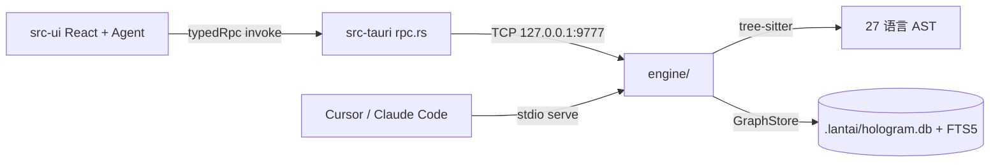

# 兰台（Lantai）— Agent 项目手册

> 生成：2026-06-18 · 更新：2026-08-22（**产品更名**：应用名 兰台 / Lantai，identifier `com.lantai.app`；**HoloGram 降级为图谱引擎专名保留**——工具域 `hologram(...)`、MCP 工具 `hologram_*`、`.lantai/` 数据目录、`HOLOGRAM_*` env、`hologram.db` 均属引擎命名空间不改。更名史见 `docs/plans/HISTORY.md`）
> 本文件是项目级静态注入文档：Codex 读 `AGENTS.md`，Claude Code 读 `CLAUDE.md`，内置兰台 Agent 把 `CLAUDE.md` 注入 system prompt。
> **编码规则不是本文件的正文，而是 `CONVENTIONS.md` + `INVARIANTS.md`；本文件负责让规则真正被执行。**

## 0. 开工前强制加载（不可跳过）

1. 先读根目录 `CONVENTIONS.md`（当前编码约定，以代码现状为准）。
2. 涉及 `src-ui/src/ui/**`、`src-ui/src/agent/**` 或 Rust 接缝时，读 `INVARIANTS.md`（已炸过的雷）。
3. 规则优先级：`docs/adr/project-constitution.md`（四条架构约定）> `INVARIANTS.md` > `CONVENTIONS.md` > 本文件 > 历史 plan/handoff。
4. 改高 fan-in 文件前先问图（内置 Agent：`graph(preflight|impact)`；外部 MCP：`preflight_check` / `trace_impact`）。
5. 规则与代码现状冲突时：以代码为准，更新规则文档，不要盲改；无法判断就停下来问用户。

## 1. 一句话

把代码库变成可对话的 3D 依赖星图，并内置多 Agent 编码工作台——用确定性的图查询替代 LLM 逐文件猜源码。

## 2. 目录结构（当前实际）

```
HoloGram/
├── engine/            Rust 分析引擎（27 静态 tree-sitter 语法；36 默认 MCP 工具 / 37 schema）
├── src-tauri/         Tauri 2 桌面壳（rpc.rs 单一 IPC 入口 + 权限沙箱 + 命令实现）
├── src-ui/            TypeScript 前端（React 19 + Three.js + Monaco + Zustand 5）
│   ├── src/app/       新观测台壳（单 React 根；新 UI 落这里）
│   ├── src/state/     zustand 状态层（领域 store + 面板/app 级 store + 信号 store）
│   ├── src/scene/     星图类型层（C13 sweep 后仅存 graph-types.ts；渲染面已退役）
│   ├── src/ui/        chat 编排域核心 + 旧层命令式基础设施（终态 25 文件，见目录 README）
│   ├── src/cordis/    vendored cordis 内核（Context/Fiber/Service；禁就地改，见目录 README）
│   ├── src/composition/ 组合层（S1+V3b+P4）：工具行表 tool-rows + prompt section 表 + 六 service 注册表（四 service + V3b 块渲染器 renderer-service + P4 A-1 prompt 段 prompt-service）
│   └── src/agent/     Agent 运行时、工具层、多 Agent、goal/plan
├── docs/              架构/ADR/交接/研究；archive/ 是历史，勿作现状依据
├── assets/            图标、UI 原型
├── grammars/          tree-sitter 动态语法产物（Kotlin/Markdown/TOML）
├── CLAUDE.md          内置 Agent 系统提示 + Claude Code 项目指令
├── AGENTS.md          本文件（Codex/OpenAI 静态注入）
├── CONVENTIONS.md     编码约定（开工前必读）
├── INVARIANTS.md      踩碎必炸的雷（改动前必读）
├── CONTEXT.md         应用级统一词汇（kind/status 重载字段带簇前缀）
└── ARCHITECTURE.md    系统架构总览
```

> `tests/` 根目录已不存在（旧 Python 测试已随引擎 Rust 化移除），不要以旧文档里的 `tests/` 路径为准。

### `.lantai/` 运行时目录

```
.lantai/
├── agents/{agentId}/             Agent 会话槽 + inbox.json（JsonMessageStore）
├── taskboard/{sessionId}.json    会话级 TaskBoard
├── discoveries/{sessionId}.json  会话级 DiscoveryBoard
├── goals/{id}/                   Goal 状态（goal.json/session.json/index.json）
├── permissions.json              项目级权限规则
├── hologram.db + FTS5            图存储/全文索引
├── baseline.json                 约束基线
├── audit.jsonl                   审计日志
├── vectors.slots.json / vectors.usearch   语义向量索引
└── logs/                         运行日志
```

## 3. 数据流



## 4. 引擎能力与工具面（2026-08-17 实测）

- **语言**：27 种 tree-sitter 语法静态链接；18 族适配器有专用结构查询（`.scm`，`engine/queries/` 共 38 个查询文件），其余静态语言走通用兜底；JSON 语法在代码中禁用（数据文件不解析）；Kotlin / Markdown / TOML 动态加载。
- **引擎 MCP 工具**：37 个 schema，默认激活 36 个（`symbol_history` 为 legacy 不默认激活；`HOLOGRAM_MCP_TOOLS=*` 放开全量）。外部 MCP 客户端（Cursor/Claude Code）仍见细粒度工具名。
- **内置 Agent 领域工具**：模型可见工具面清单/枚举/参数以生成物为唯一事实源——
  `docs/agents/model-tool-contract.md`（`scripts/gen-tool-contract-md.cjs` 从 ToolRegistry
  装配产物生成，勿手改；变更后重新生成并同 commit，vitest 守护测试对拍漂移）。
  常驻 `ask_user / Skill / wait / enter_plan_mode / exit_plan_mode` 中 ask_user/wait 在注册表面内，
  其余为 blueprint 会话级装配。P2/P3（2026-08-23）：执行原语 `code_execution` 落地（blueprint
  capability `code-execution-tool`；经 ctx.codeRuntime 服务运行——vendored cordis Service，
  agent/code-run/ 四件：protocol 腰线 / bootstrap worker 源 / host 敌意校验+预算 / 工具本体；
  程序内 `await tools.<name>(args)` 嵌套调全部可见工具，子分发逐条落 session-log
  `tool/code-dispatch-start|code-dispatch` 审计对，门禁不豁免）。S3（2026-08-22）：settings 面板域经第一方插件贡献
  （`plugins/settings-plugin.ts` 面板 + 命令双通道；paper 同步补齐 `paper/toggle`）——
  `PANEL_DEFS` 常量面清空，快捷键链路经 `app/actions.ts` 别名翻译层
  （`ACTION_CONTRIBUTION_ALIASES`）桥接到域贡献 id，useGlobalKeys 字面量不变。
  - `graph`：symbols / semantic（语义检索——向量索引按含义找符号，不知确切名字时用）/ neighbors / impact / preflight / cycles / coupling / fragile / flows / dataflow / dataflow_save / dataflow_query 等 27 个动作（dataflow_save 为写动作）——**改代码前先问图**。
  - `ops`：analyze / validate / health / status / timeline / rename / import_scip。
  - `lsp`：resolve_call / infer_type / implementations / references。
  - `fs`：read / write / edit / list / glob / mkdir / move / rename / delete / constraints（读）/ write_constraints（写 hologram.constraints.yaml——补齐 check_boundaries 发现违规后的规则固化闭环）。
  - `browser` / `desktop`（2026-08 computer-use 改造）：desktop 为进程内 UIA COM（`src-tauri/src/uia/` 专用线程 + 树缓存），写动作返回 world-diff；权限分层=窗口接管 Ask 一次 + 敏感目标/物理输入单独 Ask + 全局输入租约（`INVARIANTS.md` 物理输入铁律）；`desktop(probe)` 每窗口带 cdp/uia/vision 通道路由建议；desktop 写动作全量审计（`desktop(audit)` 可查）；敏感词表在 `src-tauri/src/sensitive.rs`（browser/desktop 共享单一事实源）。
  - 旧细粒度名（`search_symbols`、`run_shell`、`write_file`、`git_*`、`agent_spawn` 等）保留但 `hide()`；模型调用会被 `retireRedirect` 拦截并给 `[已淘汰]` 重定向。内部代码/测试仍可直接用旧名。

## 5. 快速操作（Agent 视角）

| 任务 | 命令/工具 |
|---|---|
| 探索代码结构 | 内置 `graph(symbols|explore|neighbors)`；外部 MCP `explore_deps` / `search_symbols` |
| 改文件前影响面 | 内置 `graph(action:'preflight', path:[...])`；外部 MCP `preflight_check` |
| 高风险模块 | `graph(fragile)` / `graph(cycles)` / `graph(blindspots)` |
| 改引擎 | `cd engine && cargo test`（快验 `cargo build`） |
| 改前端 | `cd src-ui && npm run build` + `npx vitest run` |
| 改壳 | `cd src-tauri && cargo test`（快验 `cargo check`） |
| 桌面打包 | `cd src-tauri && cargo tauri build`（自动先跑前端构建） |
| 前端格式 | `cd src-ui && npx biome check --write <改动文件>` |

## 6. 前端分层铁律（详情见 CONVENTIONS.md）

- UI 状态走 zustand store，事件总线已归零（2026-08-19 `docs/archive/eventbus-zero-and-ui-split-plan.md` P0-P3 竣工）：`ui/events.ts` 整文件删除（EventBus/bus/BusEvents 不存在了，禁复活——不要 window.dispatchEvent / CustomEvent / 自建 EventEmitter）；原 11 事件全迁 zustand 信号 store。ui/ 拆分终态：store 一律 `src/state/`（领域 + 面板 + app 级 + 信号 store）、`src/scene/` 仅存星图类型模块 graph-types.ts（C13 sweep 2026-08-22：Three.js 渲染面 22 文件删除，`ui/graph.ts` shim 重指向类型模块，冻结文件 chat-stream 的 type import 走此层不变）、`ui/` 残余 = chat 编排域核心 + 旧层命令式基础设施（见 `src/ui/README.md`）。终态守护 `tests/eventbus-zero-and-ui-split.test.ts` 与 `tests/ui-react-retirement.test.ts`。
- 面板级状态用 `createScopedStore` 注册表（`state/` 的 messages/session/panel/input 四件套，聚合入口 `ui/chat-store.ts`）；app 级单例用 `app/shell-store` / `state/dock-store` / `state/overlay-store`。
- 聊天消息原地 mutate 后必须 `touchMessage / touchMessageContaining`——裸 `bump()` 或展开数组会静默卡 UI（`INVARIANTS #1/#2/#3`）。
- 冻结文件：`ui/chat-session.ts`、`ui/chat-stream.ts`、`ui/part-mutator.ts`、`agent/execution-state.ts`。
- 样式只写 `--obs-*` token；不引入新 CSS 方案；DOM 所有权按层划分（React UI 不自建游离 DOM，星图 scene / Monaco 宿主是既有 imperative-DOM 所有者）。
- 工作区级资源两原语（详情 CONVENTIONS.md §1.10 + INVARIANTS #12；2026-08-18 cordis-migration P1 起登记原语为 fiber effect）：**获取必须以 `Workspace._fiber.ctx.effect(() => disposer, 'label')` 登记**（setupAgent 顺序敏感组打包 DisposerBag 作单个 effect）；**跨工作区 fire-and-forget 写共享态必须 `getWorkspaceEpoch()/isCurrentEpoch()` 校验**。deactivate/forceClearState 只调 `fiber.dispose()` + `bumpWorkspaceEpoch()`；P3 起子系统服务化样板 = `ui/lsp-client.ts` LspService（状态收进 Service 挂工作区 fiber，模块函数薄转发保消费面）。

## 7. RPC 与工具契约（详情见 CONVENTIONS.md + INVARIANTS #7-#10）

- 前端一律 `typedRpc / typedListen`（`src-ui/src/rpc-contract.ts`），参数键 snake_case，返回 string（JSON 用 `parseJson`）。裸 `rpc` 只允许两个受权出口：`rpc-contract.ts` 与 `agent/tool.ts`，biome 禁新增。
- 新增模型工具必须 `defineTool` + zod v4：一个 schema 产出 JSON Schema / 运行时校验 / 类型化参数。内部 `.passthrough()` 透传 meta key；`_forceGate` 要声明、`_callId/_agent_id` 不声明。
- 工具 execute 必须全量透传 args——重建参数对象会丢掉 `_agent_id`，fork 子 Agent 会直写主仓（2026-08-13 事故）。
- 新增领域动作同步 `tools/domains.ts` 的 `DOMAIN_SPECS` + `collectHiddenToolNames()` + 对应测试 + 本文件。引擎侧新增 MCP 工具必须同时接进 `DOMAIN_SPECS`（graph/ops/lsp）——`tests/engine-tool-surface.test.ts` 钉住「引擎默认清单 ↔ 领域映射 ↔ mock 清单」三层对齐，漏接会红。
- Agent 装配（组合架构 S1 三层 + S2 外化 + S4 preset realm/热重载/安装通道，2026-08-20 起）：**内置工具族**（hologram/fs/shell/web/agent-isolation/ask/skill/memory/task/agent/browser-desktop/wait，12 族）加行到 `src/composition/tool-rows.ts` 行表（factory → Tool[]，行内重名装载期拒绝）；**第一方工具域插件**（P4 B① 起：git/search 两域）经 `ctx.tools` 贡献通道注册（`plugins/git-search-plugin.ts`，清单单一真源 `composition/first-party-tools.ts`，loader 表尾装载；贡献 factory 可选收 ToolRowContext——依赖装配期真值的族不经此通道）；**system-prompt 段落**（persona/规则/记忆/运行环境）加段到 `src/composition/prompt-sections.ts` section 表（id + applicable + render，分隔符是字节契约禁规整）；**插件 prompt 段贡献**（P4 A-1 起）经 `ctx.prompts` 通道注册（`composition/prompt-service.ts`——追加在解析产物末尾，下次装配生效，不进 roster 寻址域）；**会话级工具/hook**（plan/通信/discovery/merge/board/kill/request/spawn/task/compaction/converge）加项到 `agent/blueprint.ts` capability 表，不改 `AgentConfig`（冻结 31 字段）。三层表序 = 字节契约（前缀缓存 + effective 快照依赖此序）；capability 只做组合，teardown 走 `ctx.effect`。面板/命令/工具/provider/块渲染器/prompt 段 六 service 注册表挂根 Context（`src/composition/services.ts` 四件 + V3b `renderer-service.tsx` 块渲染器——纸壳块体渲染经 `resolveRenderer(kind)` 解析，后注册胜 + P4 A-1 `prompt-service.ts` prompt 段）；**S4 起消费闭环已接线**——面板清单 = `panelDefs()`（常量 + ctx.panels 贡献）、命令面板合流 ctx.commands 折算、插件工具经 `composition/plugin-tool-rows.ts` 折算（行 id `plugin/<贡献 id>`）进 buildToolRegistry、插件 prompt 段经 `assembleSystemPrompt` 末端追加（面板/命令即时生效、工具与 prompt 段下次装配生效）。**preset realm**：`composition/presets.ts` 内置表（standard/minimal）+ `preset-discovery.ts` 用户目录（`~/.lantai/composition/presets/<id>/`）+ `preset-assembly.ts`（resolveCurrentComposition 引用稳定 cache + settings↔store 选择同步）；层序 factory → 用户层 → preset；装配面可选 composition 覆盖参数（`createAgentFromContext` 第 4 参 / `createAgent` 第 2 参，缺省 = S2 零漂移）；子 Agent 经 ctx composition 服务继承。**热重载**：Rust composition_watcher → `composition:changed` → `reloadCompositionPatch`（根级 patch 保存即新装配生效；在途会话冻结）。**插件安装通道**：`plugin_install`/`plugin_uninstall`/`plugin_set_enabled` RPC + 设置面板「插件」tab；插件必须自包含（无裸 import——宿主桥 `window.__lantai_plugin_host__` 提供 createElement/notify；写法范本 `examples/plugins/hello/`；插件面人类契约 `docs/plugins/README.md`）。**S2 起用户层 patch**（`~/.lantai/composition/roster.patch.yml`，经 `composition/roster.ts` 的 `resolveRoster` 解析）可禁用/覆盖/插入四域行（**寻址域只含 builtin 行**——plugin 贡献行/段不可寻址，S4-4 机器桥批扩展）——改 roster 引擎/patch 语义必读 `docs/composition/README.md`；**12 壳行**（`composition/shell-rows.ts` 表 + `src/shell/rows/*` 实现 + `src/shell/boot.ts` 编排器）承载 main.ts 引导职责，新引导接线加壳行不是往 main.ts 堆代码。
- session 变异（Phase 5 立规）：只走 `_appendMessage / _replaceSession / _retractSessionRange` 三入口（spec AST 白名单 + gate 计数双层门禁）；改工具折叠逻辑必须同步 `session-log.ts` 的 `derivePayload`。
- 改 `src-ui/src/agent/**` 或 `src-ui/src/composition/**` 必过 `npm run verify:convergence`（T0 静态 + 8 baseline 对拍；不设 `CONVERGENCE_PRESET` 直接跑——standard 快照逐字节零漂移是组合层的硬门禁）；record 永不上 CI，baseline 变更走 `docs/archive/agent-core-convergence/baseline-change-request.md` 审批。
- 新增 RPC：`src-tauri/src/rpc.rs` 分支 + 前端 `RpcContract`；`docs/agents/frontend-rpc-contract.md` 由 `scripts/gen-rpc-contract-md.cjs` 生成，勿手改。

## 8. 多 Agent 并发纪律（事故报告：docs/agents/platform-bugs-2026-08-13.md）

- 子 Agent 注册表必须 `convergeRegistry(subTools)` 重建领域工具；克隆来的 `fs/shell` 闭包绑父注册表，不重建会绕过所有权包装、构建禁令、plan 只读。
- 文件所有权（`file-ownership.ts`）覆盖 fresh 与隔离降级的 fork；claim 键斜杠归一。
- merge 据实三原则：无产出不报 ✅；清理失败 ≠ 合并失败；冲突保留 worktree（diff 有 32KB 截断，worktree 是全量现场）。`agent(merge)` 进程内串行。
- `edit_file` 并发安全在 Rust 临界区（`editor.rs checked_write_atomic`：进程级锁 + fail-closed 重读校验）；TS 侧不得假设「返回成功 = 落盘」之外的时序。
- TTL 清理不得销毁无记录的工作：discard 前抓 diff 回 board，抓不到保留现场并通知父 Agent。
- 模型可见子 Agent ID `sub-{timestamp}-{random}`；worktree ID `agent-{timestamp}-{random}`；池内部 ID 不暴露给模型。

## 9. Goal / Plan 模式要点

- `/goal`：`goal-manager.ts` 驱动 `Agent._goalLoop`；状态在 `.lantai/goals/{id}/`，与普通聊天槽隔离；完成靠 `goal_report` 工具，`[GOAL_COMPLETE]` 只是旧会话 fallback。
- Plan 模式：工具 schema 跨模式恒定（保护 DeepSeek 前缀缓存）；写约束由 `planGate` 在执行层拦截。只读动作放行，fs write/edit 计划文件豁免，agent spawn 豁免；plan 中 spawn 的子 Agent 静态只读（`planRegistry()`）。

## 10. 验证基线（2026-08-20 实测，数字会漂移，以重新实测为准）

| 层 | 命令 | 基线 |
|---|---|---|
| 引擎 | `cd engine && cargo test` | 697 tests（lib 669 + bin 27 + doc 1；696 passed / 1 ignored） |
| 壳 | `cd src-tauri && cargo test` | bin 389 + 集成 14（2026-08-22 第 5 棒实测全绿，含 rpc Value 化第二步 +1 测试；cdp e2e 按环境偶现 ±1，UIA 真实窗口 e2e 需 `HOLOGRAM_UIA_E2E=1`） |
| 前端 | `cd src-ui && npx vitest run` | 158 文件 1566 passed / 1 skipped（2026-08-23 P4 A-1 实测，+git-search-plugin 8 用例 + prompt-service 9 用例；convergence 双 preset 零漂移；本机注意：父进程带 `NODE_ENV=production` 会使 convergence specs 收集阶段报 `No such built-in module: node:` 并剥 devDependencies——跑测试前清掉该变量） |
| 前端构建 | `cd src-ui && npm run build` | tsc --noEmit + vite build 全绿 |
| Agent 运行时/组合层 | `cd src-ui && npm run verify:convergence` | exit 0（T0 静态 + 全部 phase specs 对拍 8 baseline + system-prompt.fixture；standard preset 零漂移）；baseline 变更走 `docs/archive/agent-core-convergence/baseline-change-request.md` 审批 |
| 前端格式 | `cd src-ui && npx biome ci .` | 588 errors / 335 warnings 是存量基线，不要顺手清；改动文件零新增 |
| 打包 | `cd src-tauri && cargo tauri build` | 发布构建；不要用 `cargo build --release` 代替 |

CI 只做编译 + 测试；`.github/workflows/ci.yml` 不可修改。

## 11. 不要做的事

- 不要恢复 Python 引擎路径（`src_python/` 已退役，`tests/` 已移除）。
- 不要改 `graph-layout.ts` / `gpu-layout.ts` 的布局参数（除非用户明确要求）。
- 不要在应用程序层「推断 bug 根源 / 解释因果」——产品只呈现图数据；编码 Agent 的排查推理不受此限制。
- 不要用 `cargo build --release` 代替 `cargo tauri build`。
- 不要动 `.github/workflows/ci.yml`。
- 不要把与任务无关的未提交改动混进 commit；用户工作区改动要单独确认。

## 12. 文档地图（只信这些是现状）

| 文档 | 作用 |
|---|---|
| `CONVENTIONS.md` / `INVARIANTS.md` | 编码规则 + 雷区（开工前必读） |
| `docs/adr/project-constitution.md` | 四条最高架构约定 |
| `docs/landmine-map.md` | 已知技术债/雷区拆弹状态 |
| `docs/README.md` | 文档总索引（先看这个） |
| `ARCHITECTURE.md` / `README.md` | 架构总览 / 使用与构建 |
| `CONTEXT.md` | 应用级词汇（`kind`/`status` 带簇前缀） |
| `docs/MULTI_AGENT_ROADMAP.md` | 多 Agent 路线图与已落地能力 |
| `docs/plans/README.md` | 计划现状入口（现在在哪/还剩什么/谁判断——先看这个）；里程碑时间轴在 `docs/plans/HISTORY.md` |
| `docs/agents/frontend-rpc-contract.md` | RPC 契约生成物（勿手改） |
| `docs/archive/README.md` | 归档说明与历史目录 |
