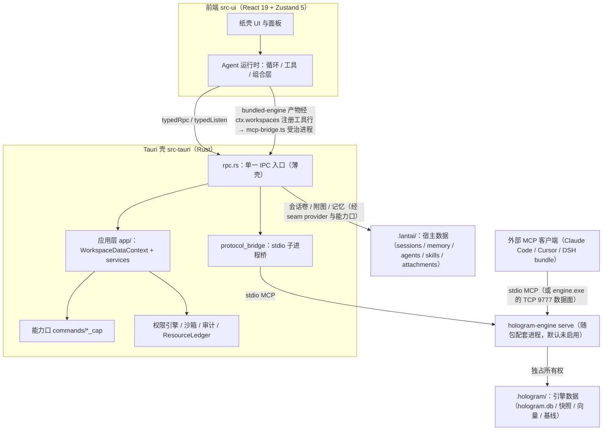

# 兰台（Lantai）— 核心能力与技术架构

> © 2026 Wenbing Jing. MIT License.
> 最后更新：2026-09-16（文档面重构 P2：现状层按代码真源逐条校准——跨文档数字改为指针，目录结构 / 数据流 /
> 引擎能力面 / 验证基线四处清单重建）。
> 本页是**现状层（L2）**：回答「系统现在是什么样」。规则见 `CONVENTIONS.md` / `INVARIANTS.md`，
> 最高约定见 `docs/adr/project-constitution.md`；现在在哪、还剩什么见 `docs/plans/README.md`；
> 历史（不是现状）见 `docs/archive/`。
> **数字纪律**：跨文档复述的标量（字段数 / 插件数 / 契约版本 / 域数 / 引擎工具数）只准来自生成物
> `docs/facts.generated.md`——本页不复述，只给指针；其余数字均标注代码真源。

## 0. 定位

**兰台（Lantai）= 以「纸壳 · 注疏案卷」为唯一主界面的桌面 Agent 软件。**
技术形态：Tauri 2 壳（Rust）+ TypeScript / React 19 前端；Agent 循环、组合层与插件系统全在前端，
壳负责通道、权限、沙箱、进程治理与凭据。

**HoloGram（代码图谱引擎）是随包配套的独立进程与独立产品面**，不是应用内的主叙事：
它以 `hologram-engine serve`（stdio MCP）对外提供图能力，兰台侧**默认不启用**（用户按需开启），
外部 MCP 客户端（Claude Code / Cursor / DSH bundle）可独立消费同一二进制。

工作台本体完全插件化：贡献通道（面板 / 命令 / 工具 / LLM adapter / prompt 段 / 渲染器 / 工具管道钩子 /
capability / overlay）与 seam provider 注册表（fs / shell / sessionPersistence / subagents / agentLoop）
——全量清单与寻址域见 `docs/plugins/README.md` §0，内核单源 = `src-ui/src/composition/contribution-channel.ts`；
出厂态没有任何一行硬编码特权（出厂产物从磁盘通道装载，exe 只留内核装配台）。

---

## 1. 核心能力总览

| 能力域 | 定位 | 实现位置（真源） |
|---|---|---|
| **注疏案卷工作台（纸壳）** | 主界面：文类块 + 矿物墨色语义 + 无限画布纸条与流区 + 书脊卷列 | `src-ui/src/paper/` · `src-ui/src/app/paper/` · `plugins/builtin/paper-shell/` |
| **Agent 自主执行系统** | 多轮工具调用循环、多 Agent 协作、上下文压缩、Plan / Goal | `src-ui/src/agent/` |
| **组合层与插件系统** | 贡献通道 + seam provider 注册表 + manifest / roster / preset / 热重载（清单见 `docs/plugins/README.md` §0） | `src-ui/src/composition/` · `src-ui/src/plugins/` |
| **Harness Engineering** | 约束治理（引擎侧）、权限引擎、三层沙箱、worktree 隔离、审计 | `src-tauri/src/permissions/` · `sandbox.rs` · `os_sandbox.rs` · `confined_fs.rs` · `agent_isolation.rs` |
| **代码图谱引擎（HoloGram，随包配套）** | 多语言 AST → 依赖拓扑图 → 耦合 / 社区 / 数据流分析 + 语义向量索引 | `engine/` · `hologram-graph/` · `hologram-storage/` · `hologram-vector/` |
| **引擎开放面** | 模型工具面 + 壳专属方法（host API）+ 免编译扩展面 | 生成物 `docs/agents/engine-plugin-contract.md` |

---

## 2. 架构分层与数据流

### 2.1 数据流（现状）



要点（都在代码里可指）：
- **前端到壳只有一条路**：`typedRpc()` / `typedListen()`（`src-ui/src/rpc-contract.ts`），参数键 snake_case；
  壳侧只有一个 `#[tauri::command] rpc(method, params)`（`src-tauri/src/rpc.rs`），命令实现是薄壳，业务编排在
  `src-tauri/src/app/`。
- **壳不拉起引擎**：壳内零 `spawn engine` 代码（`engine_transport.rs` 已删），对引擎的全部知识 =
  二进制位置只读探测（`engine_assets.rs` 的 `engine_bundled_info`）+ MCP 协议。启用态由前端产物
  `src-ui/src/plugins/builtin/bundled-engine/`（经内核 `ctx.workspaces` 的工作区接线贡献面，批 10）
  经既有 MCP 受治进程通道（`mcp-bridge.ts` 的 `ServerGovernor`）拉起——探测与开关（`probeBundledEngine` /
  `isBundledEngineEnabled`，设置面板取用）留内核 `src-ui/src/plugins/bundled-engine-prefs.ts`；
  工具面折算为一条工具行贡献（行 id `plugin/hologram-engine/mcp/hologram`，工具名 `mcp__hologram__*`），
  可被 roster.patch / preset 禁用。
- **数据分居**：引擎数据独占 `<root>/.hologram/`（真源 `hologram-graph/src/paths.rs`），宿主数据落
  `<workspace>/.lantai/`；老项目 `.lantai` 里的引擎文件由引擎启动时的 `migrate_engine_data` 自动搬迁。

### 2.2 三层边界

- **Engine（`hologram-engine`，Rust 库 + CLI/MCP 二进制）**：可独立 `serve` 为 MCP 服务器；**单根终身不变**
  （`Engine::open(root)`，切换工作区 = 换进程）；一个进程只服务一个工作区根（`ensure_ready` 同根幂等、
  异根拒绝）。免编译扩展面：`HOLOGRAM_PLUGIN_DIR`（缺省 `<root>/plugins`）读 manifest 声明
  language / framework / tool 三类扩展，不改一行 Rust（示例 `examples/engine-plugins/`）。
- **Rust crate 四层（根 workspace）**：`hologram-graph`（纯类型：Node / Edge / Graph / ID 驻留器 +
  数据目录真源）← `hologram-vector`（纯计算：usearch 索引 + MiniLM 嵌入）← `hologram-storage`
  （数据家：GraphStore / SQLite / 快照 / StoreHost，不依赖 engine）← `hologram-engine`（分析器 + CLI/MCP 二进制）。
  workspace members 见根 `Cargo.toml`（另含 `src-tauri`）。
- **Tauri 壳**：通道（`rpc.rs` 薄壳）、权限裁决、沙箱、进程与生命周期治理、插件安装 / 授权通道、凭据。
- **前端**：Agent 运行时（循环、工具、组合层、插件系统）+ 用户界面（注疏案卷纸壳）。Agent 循环在
  TypeScript 里跑，理由见 §10.3。

### 2.3 关键运行时事实

- **工作区即容器**（`src-tauri/src/app/`）：`AppContexts` 持有「canonical 根 → WorkspaceDataContext」注册表，
  决议链 = 显式 path → 活动单槽工作区 → None；会话**物理归属工作区**（唯一存储位
  `{ws}/.lantai/sessions/`），因此不需要会话绑定表与焦点投影。
- **`WorkspaceHandle`（Rust）**：单个打开项目的壳层状态（权限上下文、watcher、审计）。
- **`ResourceLedger`**：统一生命周期管理。注册的服务见 `src-tauri/src/main.rs` 的 `ledger.register` 调用点
  （LlmProxy / BgJobs / Pty / Lsp / Uia / MemoryBundle / Logging），退出时按注册序 drain（总预算 + 强退）。
- **引擎多实例**：全局槽 `ENGINE: RwLock<Option<Arc<Engine>>>` 仅作 engine 二进制自身（MCP serve / CLI）的
  回退锚点；进程外形态下壳不可见此槽，同根双实例由「一进程一根」结构性杜绝。
- **Workspace（前端）**：cordis fiber 宿主 + Zustand；工作区级资源以 `fiber.ctx.effect()` 就地登记，
  `old.deactivate()` = fiber dispose-to-quiescence + epoch 推进。epoch 代际防护永久保留
  （fiber 管所有权，epoch 管逃逸所有权的在途回调）。
- **组合身份随卷走**：卷文件记录本卷创建时生效的组合 id；UI 之外按组合起卷的单点是
  `app/chat/session-composition.ts` 的 `createSessionWithPreset(ctx, presetId?)`（只收 preset id，不可解析则
  拒绝创建 + 具名原因）。

---

## 3. Harness Engineering 模式

### 3.1 约束治理（Constraint Governance，引擎侧）

`hologram.constraints.yaml`（根目录）定义不可逾越的架构边界——耦合深度路由开关（L1-L5）、阈值
（波及半径上限、跨社区边容忍）、allowlist / denylist。**消费方是引擎**：`preflight_check`
（编辑前按图谱拓扑算波及半径 / 跨社区影响 / L4 穿透，决定放行或路由人工确认）与 `run_check`
（基线 load / diff / save + 违规信号 + 时间线记录）都是引擎工具，清单见生成物
`docs/agents/engine-plugin-contract.md`。

> **兰台侧无消费方**：`constraints_cap` 能力口随图谱内置接线整量退役（2026-09-09）已删除；该 yaml
> 如今仅服务引擎 `run_check`（`src-tauri/src/rpc.rs` 的退役注记）。

### 3.2 沙箱隔离（Sandboxed Agent Execution）

**OS 层沙箱**（`os_sandbox.rs`，跨平台）：
- Windows：每条命令一个独立 Job Object（`TerminateJobObject` 内核级终止 + `KILL_ON_JOB_CLOSE` 防孤儿；
  AppContainer 已移除——它与通用开发工具链冲突：后者会生成深层进程树、从不可预测路径加载 DLL，
  文件系统与网络隔离交权限引擎负责）
- macOS：`sandbox-exec`；Linux：`bubblewrap`

**路径层沙箱**（`sandbox.rs`）：路径 canonicalize + 边界校验，`resolve_read / resolve_write` 返回
`Allowed / Denied`；边界外路径不硬拒，交权限引擎路由到 Ask（降级策略）。

**统一受限文件系统**（`confined_fs.rs`）：所有文件 I/O 的统一 confine 层——读写各 100 MiB 上限、30s 超时、
3 次瞬态重试（指数退避）、原子写（tmp + rename）；ACL 式路径控制由权限引擎承担。

**Agent worktree 隔离**（`agent_isolation.rs`）：
- `git worktree add --detach` 为每个子 Agent 建独立工作树；路径双向映射（逻辑 ↔ 物理），权限检查、shell cwd、
  git repo 路径全部经映射
- 完成后按 `original_head..head` **范围 cherry-pick** 回主仓（冲突则 abort 保持主仓干净并返回 diff 供人工处理）
- TTL 清理 + `force_purge` 兜底；git 操作经 `src-ui/src/agent/isolation-queue.ts` 串行化

### 3.3 权限引擎（Permission Engine）

`PermissionContext` + `has_permission_to_use_tool(ctx, agent_id)` 返回四态：

```
Allow         → 直接执行
Deny{reason}  → 拒绝并给出原因
Ask{danger}   → 路由用户确认（danger = "critical" 时前端显示红色警告卡）
Passthrough   → 交引擎兜底
```

- **规则**（`permissions/rule.rs`）：system / project / session 三来源合并，项目规则持久化到
  `.lantai/permissions.json`；路径 glob、读写分类、危险操作标记
- **Tool trait 实现**（`src-tauri/src/tools/mod.rs`）：Read / Edit / Bash / Git / WebFetch / Browser /
  Desktop / Office——以该文件的 `impl Tool for` 为准（新增族在此登记）
- **bash 启发式**（`permissions/bash.rs`）：命令 tokenize + 危险命令清单
- **worktree 感知**：物理路径 reverse-map 回主仓库逻辑路径，`Edit("src/**")` 在隔离环境下同样生效
- **agent_id 显式传递**：涉路径命令接受 `_agent_id` 并 `.as_deref()` 下传，杜绝并行子 Agent 身份串扰

### 3.4 审计（Audit Trail）

`audit.rs` 记录 Agent 工具调用的 allowed / denied 轨迹；browser 与 desktop 写动作各自落
`hologram-*-audit-YYYYMMDD.jsonl`（按日轮转，可经工具查询）；宿主结构化日志落
`.lantai/logs/ui.log`（NDJSON）。会话的事件日志即真相（`.lantai/sessions/{id}.ndjson`，见 §9）。

### 3.5 技能系统（Hot-Loading Skills）

技能是目录包：`<workspace>/.lantai/skills/<name>/SKILL.md` 与用户级 `~/.lantai/skills/<name>/SKILL.md`
（双发现根）。无技能 = 零注入；新增技能无需重启。

### 3.6 Computer-Use（CDP 浏览器 + UIA 桌面）

两条通道共享同一套 Agent-first 交互范式：**snapshot / tree + ref 引用 → pattern 优先操作 → world-diff 反馈 →
分层授权 → 逐动作审计 + `[CODE]` 结构化错误**。

- **browser**（CDP，`src-tauri/src/cdp/`）：受控 Chrome 启动 / 外部实例连接、按 agent 键控多账号会话
  （slot + 空闲租约）、snapshot（AX 优先）+ ref、console / network / dialog 观察、敏感目标单独 Ask、审计 jsonl。
- **desktop**（UIA，`src-tauri/src/uia/`）：进程内 COM 跑在专用线程（MTA + `catch_unwind` + 超时），
  全量 COM 对象独占；树缓存（hwnd → generation + controls + 元素句柄），ref = 全量树下标，失效自动重建一次。
- 读路径零打扰（tree / find / read / wait 不抢前台）；pattern 动作（Invoke / SetValue / Select / Expand / Scroll）
  同样无需前台；物理输入路径每次 Ask + 全局输入租约（`DesktopInputLease`，拿不到回 `[UIA_LEASE_BUSY]`）。
- 错误码 `[UIA_*]` / `[CDP_*]` 经 TS 侧 `parseStructuredError` 统一解析。

---

## 4. 内置 Agent 系统

### 4.1 Agent 循环

```
User Input → System Prompt + Tools → LLM Stream
  ↓ (流式解析)
StreamingToolExecutor（并发执行 tool calls，AbortSignal 竞速）
  ↓
Tool Results → 注入会话 → 下一轮 LLM Stream（循环至最终回答）
```

- **流式执行**：不等整条 stream 结束，`tool_use` 块完成即 dispatch（`StreamingToolExecutor`，同一回合的多个调用
  并发跑、各自与 AbortSignal 竞速）；读并行 / 写串行是 `code_execution` 程序体内嵌套调用的纪律（见 §4.8）
- **输出截断**：单工具输出上限 50KB / 2000 行（`src-ui/src/agent/truncate.ts`），超出头尾保留 + 中间省略，
  大 diff 溢写 `.lantai/spill/`
- **重试**：可重试错误指数退避，上限 3 次（`src-ui/src/agent/retry.ts`）
- **Abort 传播**：每个 pending promise 与 AbortSignal 竞速，杜绝卡死工具挂起循环

### 4.2 多 Agent 编排

`SubAgentPool`（`src-ui/src/agent/coordinator.ts`）：并发上限 5、队列 20、超时兜底 30 分钟（常量在该文件）；
两种模式 `fork`（继承父上下文）/ `fresh`；`async: true` 立即返回 agentId，完成后经 MessageBus 回 `result`；
子 Agent 各自独立 execState（不被兄弟 abort，async 模式不被用户下一条消息杀掉）；文件编辑在 worktree 中
隔离进行，合并走 `agent_isolation_merge`（范围 cherry-pick）。

**通信层**（`message-bus.ts`）：有界 inbox + 背压（满则 drop 防 OOM）、peek + ack 模型、O(1) 消息查找；
拓扑策略可注入（`topology.ts`：Tree 缺省 / Star / Mesh，越权发送抛 `TopologyDeniedError`）；持久化到
`.lantai/agents/{id}/inbox.json`（debounced 批量写）。

**共享状态板**：`TaskBoard`（子 Agent 任务状态 / filesTouched / diff，合并后转 merged）与 `DiscoveryBoard`
（探索发现，同 key 覆盖），两者按会话隔离——`.lantai/taskboard/{sessionId}.json`、
`.lantai/discoveries/{sessionId}.json`。

**生命周期**（`lifecycle-manager.ts` + 壳侧 `agent_isolation.rs`）：空闲判定、worktree 泄漏巡检、TTL 清理、
启动恢复（restore inbox / board + 孤儿检测 + 崩溃孤儿 worktree 清理）。

### 4.3 Plan 模式与目标管理

- **Plan**（`src-ui/src/agent/plan/`）：只读工具 + 计划文件写权限；`exit_plan_mode` 提交计划给用户审批
  （可带多方案）；计划文件落 `.lantai/plans/{id}.md`。
- **Goal**（`goal-manager.ts` + `goal-loop.ts`）：显式生命周期对象（active → paused → completed / failed /
  cancelled），迭代计数与停滞检测；存储隔离于 `.lantai/goals/{id}/`，不与会话历史混淆。

### 4.4 上下文记忆

| 层 | 实现 | 用途 |
|---|---|---|
| 会话记忆 | 会话卷 + 事件日志（`.lantai/sessions/`） | 当前对话上下文，压缩只作用于发送载荷 |
| 项目记忆 | `memory.ts` → `.lantai/memory/*.md` + `MEMORY.md` 索引（confidence 分级） | 跨会话项目知识 |
| 全局记忆 | `~/.lantai/global_memory/*.md` + 索引 | 跨项目个人知识 |
| Memory Bundle | 可选外部进程 `memory-bundle.exe`（在 exe 同目录找到才启动）+ HTTP 客户端 `127.0.0.1:9600` | 进程隔离的记忆服务 |

### 4.5 上下文压缩（成本模型驱动）

`compaction-model.ts` 用可测量成本模型（`NetBenefit = |R|·c_in·(T-1) − |S|·c_out − L·avg_turn_cost`）决定
何时压缩；分块摘要 + 机械兜底 + 摘要模型自动选择；结果类型 summary / digest / truncated / stuck。
**压缩只作用于发送载荷**，会话永远是完整历史（见 §10.7）。配置与统计落
`.lantai/compaction-config.json`、`.lantai/compaction-tracker.json`。

### 4.6 Hooks 系统

两类 hook 注入 Harness 逻辑（`src-ui/src/agent/hooks.ts`）：

- **Post-Tool**（`HookRegistry`）：`state-read`（每轮注入 Git 状态与诊断信息）、`build-result`（构建结果回填）
- **Pre-Tool 预检**（`PreflightHookRegistry`）：`state-preflight`（LSP 诊断状态）

> 图谱类 hook（读文件注入符号概览、编辑前图谱波及预检）随图谱内置接线整量退役（2026-09-09）已删除。
> 第三方可经 `ctx.hooks` 贡献钩子（kind = enrich / preflight），见 `composition/hook-service.ts`。

### 4.7 LLM Provider 抽象

- `provider/` 目录：统一类型（`types.ts`）+ `anthropic.ts` / `openai.ts` / `responses.ts`（协议方言）+
  `catalog.ts` 模型目录合并层 + `model-sync.ts` 动态发现 + `oauth.ts` 订阅面 + `thinking.ts`
  （档位 → 厂商 wire 参数唯一事实源）+ `vendor-templates.ts`
- **内核 seed 模型目录**：`provider/catalog/*.json`（以该目录文件为准；其余厂商模型一律运行时从 `/models`
  拉取合并）；目录再生经 `npm run gen:catalogs`
- **LLM adapter seam**（`ctx.llm`）：第一方 adapter 由插件通道贡献，后注册胜；未知 kind 响亮报错，不静默跌回
- **本地反向代理**（`llm_proxy.rs` + `transport.ts`）：loopback-only HTTP 代理，转发并强加 CORS 头，SSE 逐块透传
- **附图（多模态）**：用户消息挂内容寻址引用（字节永不进消息与卷），采集三入口（粘贴 / 拖放 / 夹选）经
  `app/chat/image-intake.ts` 准入规整（magic-byte 白名单 + EXIF 校正 + 长边 2048 重编码 + sha256 寻址）；
  能力门禁 = 生效输入模态声明（`settings.ts` 的 `modelInput`）
- 流式 chunk 类型：Text / Reasoning / ToolCallStart / ToolCall / Usage / Done / Error

### 4.8 Agent 工具体系（模型可见面）

模型可见工具面是**领域折叠**形态：一个域一个工具 + `action` 判别联合 + 常驻件（`ask_user` / `wait`）。

| 想找什么 | 去哪（唯一权威） |
|---|---|
| 模型可见工具面（域 / action / 参数 / 隐藏旧名附录） | 生成物 `docs/agents/model-tool-contract.md`（`npm run gen:tool-contract`，勿手改） |
| 域清单与域数 | 生成物 `docs/facts.generated.md`（真源 `src-ui/src/agent/tools/domains.ts` 的 `DOMAIN_SPECS`） |
| 会话级 capability 工具（Skill / plan / 通信族 / `code_execution` 等） | `src-ui/src/agent/blueprint.ts` 的 capability 表 |

- **旧细粒度名**（`search_symbols` / `run_shell` / `write_file` / `git_*` / `agent_spawn` 等）保留在
  `ToolRegistry` 但 `hide()`；模型误调由 `retireRedirect` 拦截并返回「已淘汰 → 领域动作」重定向。
- **新工具必须 `defineTool` + zod v4**：一份 schema 同时产出 JSON Schema、运行时校验与 `z.infer` 类型；
  meta key（`_forceGate` / `_callId` / `_agent_id`）经 `.passthrough()` 透传。
- **行源全量插件化**：tools 域唯一行源 = 插件通道贡献快照（`pluginToolRows()`），`buildToolRegistry` 按行表序
  装配——**表序 = 组合序 = 字节契约**（前缀缓存与 effective 快照依赖此序，禁重排）。
- **`code_execution` 执行原语**：程序体经 `ctx.codeRuntime` 在 Web Worker 沙箱执行，程序内可嵌套调用全部
  可见工具（审计逐条落 session-log，门禁 / hooks / 截断不豁免，读并行写串行）。

### 4.9 组合层与插件化

Agent 的装配面（工具行 / prompt 段 / capability 三类行源）全部经插件通道贡献，出厂 builtin 表已退役——
第一方与第三方在同一注册表上竞争，特权区只减不增。

- **贡献通道与 seam 注册表**：全量清单（含寻址域、重名拒绝、幂等 disposer、声明式 `timing` 四档）见
  `docs/plugins/README.md` §0；内核单源 = `composition/contribution-channel.ts`。seam provider 默认实现 =
  Rust / 引擎包装，强制层在管道层不在 provider 内（不可旁路）。
- **行组合层**：`~/.lantai/composition/roster.patch.yml`（用户层，可寻址禁用 / 覆盖 / 锚定全部贡献行，含第一方）
  → preset（内置 + `~/.lantai/composition/presets/` 用户目录）→ 热重载（Rust `composition_watcher` →
  `composition:changed` → `reloadCompositionPatch`，在途会话冻结）。
- **插件装载**：`~/.lantai/plugins/<name>/` 自包含 ESM，webview 动态 import（无包管理器、无 import map），
  宿主桥 `window.__lantai_plugin_host__`；manifest 支持 `tools`（声明 + `toolHandlers` 命名导出）与
  `mcpServers`（MCP 机器桥：stdio 经 Rust `protocol_bridge`，工具名 `mcp__<server>__*`，治理三档
  lifecycle / 崩溃指数退避重启 / 空闲回收 / 进程树终止）。
- **权限三层**：manifest `permissions` 声明（read / edit / bash / git / web 闭集）→ `plugins.json` `granted` 段
  授予门禁（装载期一票否决，未授权不 import 插件代码）→ Rust 命令咽喉逐调用强制。
- **契约文档**：`docs/plugins/README.md`（插件面人类契约）+ `docs/composition/README.md`（roster 语法）+
  convergence 门禁（三层表序 = 字节契约）。

---

## 5. 代码图谱分析引擎（HoloGram，随包配套）

引擎把源代码转成可查询的依赖拓扑图。它是兰台之外的独立产品面：兰台默认不启用，外部 MCP 客户端可直连。

### 5.1 统一 Engine API

`engine/src/engine/` 用单一 `Engine` 结构体替换了分散的全局变量；存储外置——图库与时间线连接住在
`hologram_storage::StoreHost`（所有权单元），**引擎自开自持**，数据落 `<root>/.hologram/`
（真源 `hologram-graph/src/paths.rs`）：

- **构造即绑根**：`Engine::open(root)`（返回即 Ready）；`new_shared(root)` = open + Arc + Weak 自引用 + 自动
  watcher。**单根终身不变**——切换工作区 = 新进程（`engine_init` 上部先跑 `migrate_engine_data`，把老
  `.lantai` 里的引擎文件搬到 `.hologram/`，幂等 + 冲突不搬）。
- **状态机**：`Ready ↔ Analyzing → Error`；**并发**：`RwLock` 读写分离，timeline 用专用 SQLite 连接（不阻塞图锁）。
- **取消令牌**：新 `analyze()` 抢占旧运行（阶段边界中止）；**panic 守卫**：`catch_unwind` 包裹流水线，
  任何 panic 都重置状态并释放锁。
- **增量**：实例方法 `try_incremental`（先试增量，失败回退全量）。
- **线程局部当前引擎**：`with_current(arc, f)` 在分派线程绑定当前实例——MCP 工具处理器无需逐个穿线
  （纪律：只存在于同步闭包内，禁跨 `.await`）。

### 5.2 分析流水线

`engine/src/pipeline/` 拆为 discovery → parser → runner：

| 阶段 | 说明 |
|---|---|
| 1. 文件发现 | 按已装语法支持的扩展名遍历项目（忽略清单见 `hologram-graph/src/ignore.rs`） |
| 2. 分批并行解析 | rayon 并行解析，**200 文件/批**（`pipeline/runner.rs` 的 `BATCH`），串行合并（内存有界） |
| 3. 解析缓存 | file_path → (source, tree) 传给后续合成阶段，消除重复 walkdir |
| 4. Cross-File Resolution | 跨文件 import / call 关系合成（`engine/src/graph/`） |
| 5. Coupling Analysis | L1-L4 耦合深度 |
| 6. Framework Routes | 框架路由检测（`analysis/framework_routes/frameworks/`，一族一文件） |
| 7. Dynamic Dispatch | 多态调用合成边 + React / Vue template + DI / 反射 + 动态 import + eval + 跨语言 + bridge / rpc 间接调用 |
| 8. Dataflow Synthesis | 函数级读写 + 共享状态 + async trigger / await 链 |
| 9. Community Detection | Leiden（扁平）+ Louvain（层级） |
| 10. DB Save | 持久化到 MemoryIndex + SQLite + 向量索引 |

特性：进度报告、`AtomicBool` 取消、每阶段计时、单文件解析超时保护、LSP 后台预热。

### 5.3 图谱数据模型

- **节点**（`hologram-graph/src/node.rs` 的 `NodeKind`）：`Symbol / Function / Class / Module / File /
  Interface / Variable / Medium / Temporal`；每节点带 id、name、kind、location、snippet（供向量搜索）、
  properties、in/out_degree、community_id。
- **边**（`hologram-graph/src/edge.rs` 的 `EdgeKind`）：`Imports / Calls / Inherits / Defines / Reads /
  Writes / Shares / Triggers / Awaits / Sequences / Usage / Throws`；每条边带 coupling_depth（L1-L4）、
  cross_file、temporal_delay_sec、lsp_resolved、is_synthesized（启发式合成边）、metadata（溯源）。

### 5.4 语义向量索引

`hologram-vector/src/` 实现代码语义搜索：

- **双后端自动选择**（`embed.rs`）：MiniLM（`minilm.rs` + `wordpiece.rs`，all-MiniLM-L6-v2 ONNX，384 维，
  经 `ort` 动态加载随引擎分发的 `onnxruntime.dll` 与 `engine/models/`）→ 不可用时跌 n-gram 哈希（零依赖兜底）
- **索引存储**：usearch HNSW（Cos 度量）+ `slots.json` 记节点 id 列表；索引落 `.hologram/vectors.usearch`
- **一致性**：`slots.json` 带后端标识，后端不匹配的旧索引自动判废；slots 数与向量数必须一致；原子落盘
- **进程级缓存**：按根键控（双工作区互不踩），mtime 变化失效重载；后台线程构建
- **暴露**：并入 `search` 域的文本 / FTS 命中返回，带 `vector_backend` 标识

### 5.5 分析能力

| 模块 | 能力 |
|---|---|
| `analysis/coupling.rs` + `coupling_report.rs` | L1-L4 四级耦合深度 + 报告 |
| `analysis/cycles.rs` | 循环依赖检测（all / data / llm 模式） |
| `analysis/dataflow_engine.rs` + `dataflow_synthesis.rs` + `flows.rs` | 函数级变量读写、跨函数共享状态、async trigger、聚合查询 |
| `analysis/fragility.rs` | 结构脆弱性排行（扇入 / 扇出 + 耦合深度） |
| `analysis/blindspots.rs` | 架构盲区扫描（L4 穿透、未锁并发、反馈环） |
| `analysis/dynamic_boundaries.rs` | 动态边界检测 |
| `analysis/policy_check.rs` | 约束规则检查（配合 `hologram.constraints.yaml`） |
| `analysis/graph_stats.rs` + `explore.rs` | 图统计 + 聚合查询 |
| `analysis/bridge_rpc.rs` + `grpc_services.rs` | bridge / rpc / gRPC 间接调用补全 |
| `community/` | Leiden + Louvain 社区检测 |
| `scip_bridge/` | SCIP 索引导入 |
| `stress.rs` | 压力测试合成项目生成器 + 基准运行器（多级规模） |

### 5.6 语言适配

- **静态语法**：`engine/Cargo.toml` 的 `tree-sitter-*` 依赖表是语言清单的**唯一真源**（Python、TypeScript、
  TSX、JavaScript、Go、Rust、Java、C、C++、Ruby、Lua、C#、PHP、Swift、Dart、Scala、OCaml、Haskell、R、Nix、
  Bash、HTML、CSS、YAML、Zig、Elixir、Erlang；JSON 语法在 `grammar.rs` 中注释禁用——数据文件不解析）。
- **查询族**：`engine/queries/*.scm` 一族一对 structure / dataflow 查询（清单以目录为准）；
  `adapter/registry.rs` 决定注册序（first-registered-wins）。
- **动态语法**：`adapter/grammar_loader.rs` + `libloading` 加载 DLL，无需重编译即可扩展语言。
- **免编译扩展**：`engine/src/plugins/` 读 `HOLOGRAM_PLUGIN_DIR` manifest，可补语言适配器 / 框架路由 / 工具
  （契约见生成物 `docs/agents/engine-plugin-contract.md`，示例 `examples/engine-plugins/`）。

### 5.7 LSP 集成

`lsp_manager.rs` 管理原生 LSP 服务器（rust-analyzer / gopls / pyright 等），提供 `resolve_call`（多态分发解析）、
`infer_type`、`find_implementations`、`find_references`；`lsp_daemon.rs` + `bin/lspd.rs` 提供常驻守护形态。
**手写协议纪律**（见 `INVARIANTS.md` #6）：帧边界按字节流扫描定界（不可 `read_line`——JSON body 内可能含 `\n`）；
解析失败把原始字节带进错误；超时分级（30s → 5s 快速失败）；回复服务器请求；死壳自愈。

### 5.8 增量更新与存储层

- **增量**：`pipeline/incremental.rs` 监听文件变更（`notify`），仅重解析变更文件并增量更新图谱，失败回退全量。
- **双层存储**（`hologram-storage/src/`）：MemoryIndex（CSR 内存图索引，高并发读）+ SQLite（WAL 持久化、
  FTS5 全文搜索、timeline 事件）+ `snapshot.rs` 快照。

---

## 6. MCP 对外服务（引擎形态）

引擎是独立 MCP Server，对外暴露工具面：

- **stdio 形态**：`hologram-engine serve --project-root <根>`（兰台与 DSH 走这条，`--tcp` 可同时再起数据面）
- **TCP 形态**：`engine.exe` 默认模式在 `127.0.0.1:9777` 监听（`main.rs` 的 `run_tcp_server`），供 Tauri 前端 /
  Unity 等外部客户端
- **工具面（模型可见默认集 / 壳专属方法 / 免编译扩展三类）**：生成物
  `docs/agents/engine-plugin-contract.md`（真源 `engine/src/contract.rs` + `engine/src/tools/mod.rs`），
  本页不复述清单与计数
- **接入示例**：`.mcp.json.example`（复制到 Claude Code / Cursor / 任意 MCP 客户端即可）
- **响应模型**：`tools/response.rs` 的 `ToolResponse` 四态——`Success(data)` / `Degraded { guidance, fallback,
  details }`（可恢复失败，给模型引导与回退建议，**不是** JSON-RPC error）/ `Refused { reason }`（安全拒绝，
  不得重试）/ `Fault { message, retry }`（真故障）；`with_suggestions` 统一附加后续工具建议。
- **新鲜度横幅**：`tools/staleness.rs`——结果引用了自上次索引同步后被编辑的文件、图经增量更新后社区 / 聚类
  结果只算近似、或 SCIP 桥接边可能过期时，相关工具结果带 ⚠️ 横幅说明（不静默冒充新鲜）。

---

## 7. 生命周期与进程管理（Tauri Shell）

### 7.1 RPC 单一入口

`rpc.rs` 的 `#[tauri::command] rpc(method, params)` 是全部前端能力的唯一 IPC 入口，实现是薄壳
（参数提取 + State 转换 + 横切），业务编排在 `src-tauri/src/app/services/`。**方法清单与方法总数以生成物
`docs/agents/frontend-rpc-contract.md` 为准**（`scripts/gen-rpc-contract-md.cjs` 再生），本页不复述。

命令族（按目录可指）：应用层（工作区数据上下文）、能力口（`commands/*_cap.rs`：search / fs / git / process /
browser / uia / web / pty / lsp / editor）、MCP / ACP stdio 桥（`protocol_bridge.rs`）、身份与权限、OAuth 订阅面、
插件安装通道（`plugin_install.rs` / `plugin_data.rs`）、隔离与工作区、浏览器与桌面、组合（`composition.rs`）。

### 7.2 ResourceLedger（统一生命周期）

`lifecycle.rs`：`LifecycleService` trait + `ResourceLedger` 中央注册表；注册点集中在 `main.rs`。退出时按注册序
drain，每服务带截止时间（Clean / Forced / Failed / NotApplicable）。替代散落在 `main.rs` 的清理逻辑。

### 7.3 凭据与外部进程

- `credential.rs`：加密凭证存储（libloading FFI 模式）+ 权限 Ask 应答校验（allow / remember / rule_to_add）
- `protocol_bridge.rs`：MCP / ACP 子进程的 stdio 桥（spawn / write / kill——kill 连进程树终止）；前端经
  `agent/mcp/tauri-io.ts` 消费
- `engine_assets.rs`：随包引擎二进制**只读探测**（多候选梯 + `LANTAI_ENGINE_EXE` 覆盖；只在命中时写缓存）
- `plugin_assets.rs` / `commands/plugin_data.rs`：插件与数据目录位置（含 `.trash` 回收）
- `composition_watcher.rs`：组合层文件监听 → `composition:changed` 事件
- `memory-bundle.exe`：可选外部记忆服务，exe 同目录存在才 spawn（生命周期挂 ResourceLedger）

---

## 8. 技术栈

### Engine（Rust，crate `hologram-engine`）

| 依赖 | 用途 |
|---|---|
| `tree-sitter` + 各语言语法 crate | 多语言 AST 解析（清单见 `engine/Cargo.toml`） |
| `libloading` | 动态语法 DLL 加载 |
| `rusqlite`（bundled） | SQLite 持久化 + FTS5 全文搜索 |
| `usearch` / `ort` | 向量索引（ANN）/ MiniLM ONNX 推理（`hologram-vector`） |
| `parking_lot` / `rayon` / `notify` | 读写锁 / 并行解析 / 文件监听 |
| `tokio` | MCP 服务端与 TCP 数据面 |
| `mimalloc` / `tracing` | 分配器 / 结构化日志 |

### Tauri Shell（Rust）

| 依赖 | 用途 |
|---|---|
| `tauri` 2.x（feature `wry`） | 桌面应用框架 |
| `tauri-plugin-dialog` / `tauri-plugin-updater` / `tauri-plugin-window-state` | 对话框 / 自动更新 / 窗口状态 |
| `portable-pty` | PTY 终端管理 |
| `tokio` / `tokio-tungstenite` | 异步通道、超时、WebSocket（CDP） |
| `ureq` / `reqwest` | HTTP（含 MCP http 桥） |
| `windows` / `libloading` | Win32（Job Object、UIA/SendInput）/ 凭证库 FFI |

### 前端（TypeScript / React 19）

| 依赖 | 用途 |
|---|---|
| `react` 19 / `react-dom` / `zustand` 5 | UI 框架与状态管理（`src/app/` 单根） |
| `@tauri-apps/api` | 壳 IPC（经 `typedRpc` 收敛） |
| `@chenglou/pretext` | 纸面排版引擎（测量 / 折行 / 虚拟化基线） |
| `react-markdown` + `remark-gfm` / `highlight.js` | 正文 markdown 与代码高亮 |
| `katex` / `echarts` / `smiles-drawer` | 科研渲染（公式 / 交互图表 / 化学式） |
| `@tanstack/react-virtual` | 长列表虚拟化 |
| `zod` 4.x | 工具 schema 单一真源（`defineTool`） |
| `gpt-tokenizer` | token 计数（压缩成本模型 / 墨量册） |
| `yaml` | roster / patch / manifest 解析 |
| `MiSans-VF.ttf` 自托管（`src/assets/fonts/` + `app/fonts.css`） | 全产品统一字体（VF 单文件全字重） |
| `vite` 6 / `vitest` 4 + `jsdom` / `biome` 2 / `typescript` 6 | 构建 / 测试 / 格式化与 lint / 类型系统 |

> `three` / `@types/three` / `@webgpu/types` / `monaco-editor` 已不在运行时使用面（桌面端不渲染 3D 星图、
> 不内嵌 Monaco）；`package.json` 里的残留条目是待清理项。

### 外部组件

| 组件 | 用途 |
|---|---|
| `hologram-engine.exe` + `grammars/` + `onnxruntime.dll` + `models/` | 随安装包分发的图引擎及其资产（`tauri.conf.json` 的 `bundle.resources`） |
| `memory-bundle.exe`（可选） | 进程隔离的记忆服务 |
| LSP 服务器 | 原生类型解析（rust-analyzer / gopls / pyright 等） |
| `officecli.exe` | Office 域工具后端（**随安装包分发**，与宿主 exe 同级；解析序 `$OFFICECLI_PATH` → 用户安装位 `~/.lantai/tools/officecli/` → **随包位** → PATH） |

---

## 9. 项目结构

### 9.1 顶层

```
兰台/
├── engine/                  # crate hologram-engine：分析器 + CLI/MCP 二进制 + 免编译扩展面
├── hologram-graph/          # crate：纯类型（Node/Edge/Graph/ID）+ 数据目录真源 paths.rs + 忽略清单
├── hologram-vector/         # crate：纯计算（usearch 索引 + MiniLM ONNX 嵌入）
├── hologram-storage/        # crate：数据家（GraphStore / SQLite / 快照 / StoreHost）
├── src-tauri/               # Tauri 桌面壳（通道 / 权限 / 沙箱 / 进程治理 / 凭据）
├── src-ui/                  # 前端（React 19 + Agent 运行时 + 组合层 + 插件系统 + 纸壳）
├── dsh-bundle/              # DSH 插件包（引擎接入 + viewer/ 3D 星图；构建来源与状态见其 README）
├── examples/                # 插件示例（plugins/ 宿主插件、engine-plugins/ 引擎免编译扩展）
├── docs/                    # 活动文档（入口 docs/README.md；facts.generated.md 是数字真源）
├── scripts/                 # 构建与门禁脚本（gen-* / doc-sync / doc-check / build-builtin-plugins）
├── assets/ · prototype/     # 图标与设计素材 / 原型草稿
├── hologram.constraints.yaml # 引擎约束治理配置（消费方 = 引擎 run_check / preflight_check）
├── build.cmd · dev.cmd      # Windows 构建 / 开发包装脚本
└── Cargo.toml               # Rust workspace（members 见文件）
```

### 9.2 引擎 `engine/src/`

```
engine/src/
├── engine/        # Engine 结构体：状态机 / 构造即绑根 / 取消令牌 / panic 守卫 / GRAMMAR_LOADER / watcher
├── pipeline/      # discovery → parser → runner（分批并行）+ incremental.rs（增量更新）
├── adapter/       # LanguageAdapter trait + registry（注册序）+ python/typescript 专用 + tree_sitter + grammar_loader（动态 DLL）
├── graph/         # 跨文件合成：import_resolver / resolver / merge
├── analysis/      # coupling / cycles / dataflow / fragility / blindspots / flows / explore / policy_check /
│                  #   framework_routes/frameworks（一族一文件）/ di_reflection / dynamic_dispatch*
├── community/     # Leiden + Louvain
├── routing/       # 框架路由检测
├── scip_bridge/   # SCIP 索引导入
├── tools/         # MCP 工具注册表 + handlers/ + response.rs + staleness.rs
├── plugins/       # 免编译扩展面（HOLOGRAM_PLUGIN_DIR manifest：language / framework / tool）
├── bin/lspd.rs    # LSP 守护形态二进制
├── mcp.rs         # MCP JSON-RPC 服务端
├── main.rs        # CLI 入口（默认 TCP 数据面 / serve 子命令）
├── contract.rs    # 引擎契约版本 + 壳专属方法清单
├── lib.rs         # 库入口
├── lsp_manager.rs # LSP 管理
├── lsp_daemon.rs  # LSP 守护
├── path_utils.rs  # migrate_engine_data（老 .lantai 引擎文件 → .hologram）
└── stress.rs      # 压力测试合成项目生成器
```

### 9.3 壳 `src-tauri/src/`

```
src-tauri/src/
├── app/               # 应用层：WorkspaceDataContext 注册表（mod.rs）+ commands.rs + services/（命令族业务）
├── commands/          # 命令薄壳：*_cap.rs（search/fs/git/process/browser/uia/web/pty/lsp/editor 能力口）+
│                      #   identity / isolation / oauth / plugin_install / plugin_data / protocol_bridge /
│                      #   composition / workspace / browser_cap / external
├── permissions/       # 权限引擎：mod（PermissionContext + 结果四态）/ rule / bash / filesystem / git / web / safety
├── tools/             # Tool trait 实现（Read / Edit / Bash / Git / WebFetch / Browser / Desktop / Office）
├── cdp/ · uia/        # 浏览器 CDP 通道 / 桌面 UIA 通道（各自含审计与 e2e）
├── oauth/             # 订阅面（OAuth）
├── utils/             # 壳内共用工具
├── rpc.rs             # 单一 IPC 入口（薄壳）
├── main.rs            # 启动、ResourceLedger 注册、外部进程 spawn
├── lifecycle.rs       # ResourceLedger + LifecycleService（注册点见 main.rs）
├── workspace.rs       # WorkspaceHandle（权限上下文 + watcher + 审计）
├── agent_isolation.rs # git worktree 生命周期 + 范围 cherry-pick 合并
├── sandbox.rs         # 路径沙箱（resolve_read / resolve_write）
├── os_sandbox.rs      # OS 层沙箱（Job Object / sandbox-exec / bubblewrap + 捆绑 MSYS2 bash）
├── confined_fs.rs     # 统一受限文件系统（限额 / 超时 / 重试 / 原子写）
├── credential.rs      # 加密凭证存储
├── sensitive.rs       # 敏感目标共享词表
├── llm_proxy.rs       # LLM 本地反向代理
├── audit.rs           # 工具审计
├── pty_manager.rs     # PTY 终端
├── lsp_manager.rs     # LSP 侧管理
├── engine_assets.rs   # 随包引擎二进制探测（只读）
├── plugin_assets.rs   # 插件资产位置与组合根
├── composition_watcher.rs # 组合层热重载监听
├── ignored_paths.rs   # 忽略清单（含 .hologram / .lantai）
├── desktop.rs · window_drag_band.rs · logging.rs   # 桌面输入 / 窗口拖拽带 / 日志
```

### 9.4 前端 `src-ui/src/`

```
src-ui/src/
├── app/            # React 根与界面：chat/（会话与创作坞）+ panels/ + paper/（纸壳视图）+ plugin-windows/
├── paper/          # 纸壳内核（形状/共享面）：block-model / markdown / ink / region-view / space / overlay-context…
│                   #   （测高引擎 measure / 版式 token 已随 paper-shell 产物，批 9c-4）
├── agent/          # Agent 系统内核（形状 + 机制 + 登记表）：agent.ts / streaming-executor / session-log /
│                   #   blueprint（capability 机制与形状——内容表已随 capability-segments 产物）/ 各域 *.ts
│                   #   契约（skill-contract / memory-contract / task-contract…）+ 门面（*-impl.ts）/
│                   #   tools/（域工具真源 domains.ts + define-tool）/ agent-loop/（流式循环契约；默认实现
│                   #   随 agent-loop-service 产物）/ runtime/（AgentRuntime + AgentBuilder）/ plan/ /
│                   #   code-run/ / token-meter/（ctx.tokenMeter 服务 + 契约）· dynamic-runner/ ·
│                   #   mcp/（MCP 客户端 + tauri-io 桥）· state-hooks-impl / subagent-*-impl（各域登记表）
│                   #   （coordinator / message-bus / memory / skills / task / acp 已随产物或退役）
├── composition/    # 组合层：contribution-channel（内核单源）/ services / tool-rows / prompt-sections /
│                   #   roster + patch-loader + presets + preset-discovery/assembly / seam-scope / activation /
│                   #   root-views-service（ctx.rootViews）· workspaces-service（ctx.workspaces）·
│                   #   shell-rows-service（ctx.shellRows）——宿主生命周期贡献面（批 9e / 批 10）
├── plugins/        # 插件层：loader / service-plugins（内核 service 单一真源）/ boot-gate / types /
│                   #   manifest 派生（first-party-manifest、builtin-roster、factory-products）/ builtin/（出厂产物真源目录）/ 
│                   #   mcp-bridge / bundled-engine-prefs（引擎探测 + 开关；接线已随产物）/ window-bridge /
│                   #   host-surface.baseline.json
├── cordis/         # vendored cordis 内核（Context / Fiber / Service；禁就地改）
├── state/          # zustand 状态层（领域 store + 面板 store + scoped-store 注册表 + prefs）
├── shell/          # 壳行引导：boot.ts + rows/（persistence / chat / keyguard / platform / workspace / cold-start …）
├── provider/       # LLM Provider 抽象 + catalog（内核 seed 目录）+ thinking / credentials / oauth /
│                   #   providers-doc·store（配方改文件批）——平台数据面（判据见 provider-data-face-homing-design.md）
├── ui/             # chat 编排域核心 + 旧层命令式基础设施（只减不增；契约见 ui/README.md）
├── lifecycle/      # WorkspaceStateMachine + 超时
├── assets/         # 字体与纸纹素材（MiSans-VF.ttf / paper-*.jpg / seal-*.jpg）
├── bridge.ts · rpc-contract.ts · settings.ts · workspace.ts · workspace-scope.ts · i18n.ts · main.ts
```

### 9.5 运行时数据目录

**工作区级 `<workspace>/.lantai/`（宿主数据）**：

```
{workspace}/.lantai/
├── sessions/              # 会话卷：{id}.json（快照缓存）+ {id}.ndjson（事件日志 = 真相）+ _active.json（id 分配）
├── attachments/           # 附图字节（内容寻址 {sha256}.{ext}；消息只存引用）
├── memory/                # 项目记忆 *.md + MEMORY.md 索引
├── agents/{id}/           # 每 Agent 的 inbox.json（多 Agent 通信持久化）
├── goals/{id}/            # Goal 模式存储（与会话槽隔离）
├── plans/{id}.md          # Plan 模式计划文件
├── skills/<name>/SKILL.md # 项目级技能（热加载）
├── taskboard/{sessionId}.json    # 子 Agent 任务状态板（按卷隔离）
├── discoveries/{sessionId}.json  # 探索发现板（按卷隔离）
├── worktrees/{isolationId}/      # 子 Agent 隔离工作树（git worktree --detach）
├── spill/                        # 大 diff / 超长输出溢写
├── logs/ui.log                   # 宿主结构化日志（NDJSON）
├── canvas.json                   # 工作区级画布（纸条 / 流区 / 视口；不随卷快照）
├── compaction-config.json · compaction-tracker.json   # 压缩配置与统计
└── permissions.json              # 项目级权限规则
```

**用户级 `~/.lantai/`**：`plugins/<name>/`（插件安装位）+ `plugins/plugins.json`（granted 授权与启用态）、
`mcp.json`（用户级 MCP server 声明）、`composition/`（组合层用户层：roster.patch.yml + presets/）、
`skills/`、`global_memory/`、`workspaces.json`（用户绑定过的目录）、`tools/officecli/`。

**引擎级 `<root>/.hologram/`（引擎独占，宿主零句柄）**：`hologram.db`（图库 + FTS5 + timeline）、
`vectors.usearch` + `vectors.slots.json`（向量索引）、快照、`baseline.json`、引擎侧 `logs/`。
老项目 `.lantai` 下的引擎文件（`hologram.db` / `vectors.*`）由引擎启动时的 `migrate_engine_data` 搬迁；
`.lantai/dataflow/` 等图谱时代目录随内置接线退役，不再是现状。

**卸载期的用户级清理**：卸载器在用户选择「删除应用程序数据」时调 `lantai.exe --purge-user-data`——
目录清单真源 `src-tauri/src/purge.rs`，挂接点 = NSIS 钩子 `nsis/installer-hooks.nsh`（安装器不复述路径）。
覆盖 `~/.lantai`、改名老位 `~/.hologram`、以及 `%APPDATA%`/`%LOCALAPPDATA%` 下兰台目录（含旧
identifier）。**缺省不删**（勾选框缺省不勾；静默/被动卸载与自动更新的 `/UPDATE` 路径勾选态恒为 0，
脚本化完全卸载走 `uninstall.exe /S /PURGE-DATA`）；**工作区级 `{workspace}/.lantai` 与
`{workspace}/.hologram` 永不随卸载删除**。Windows 自 2026-09-26 起**只发 NSIS**
（`tauri.windows.conf.json` 的 `bundle.targets`，用户拍板）：旧 `.msi` 从来没有过清理通路
（Tauri 的 WiX fragment 装不进自定义动作，实测已发布的 MSI 里从没出现过），也不再产出新的 `.msi`。
见 [`docs/plans/uninstall-purge-plan.md`](docs/plans/uninstall-purge-plan.md)。

---

## 10. 关键设计决策

### 10.1 为什么 Engine 是独立二进制 + 独立进程

引擎编译为 `hologram-engine.exe`，兰台与外部 MCP 客户端消费同一二进制，且**一个进程只服务一个工作区根**。
带来：外部客户端无需安装桌面应用即可用图能力；引擎崩溃不影响宿主（宿主按 MCP 受治进程通道重启）；
引擎性能不受 webview 开销影响；**多工作区并行的正确性由「一进程一根」结构性保证**，不靠调用方自觉。
引擎能力面支持免编译扩展（`HOLOGRAM_PLUGIN_DIR` manifest）。

### 10.2 为什么 Tauri 壳只做通道

`rpc.rs` 全是薄壳，业务编排在 `app/services/` 应用层；工具业务经能力口直呼；模型面工具编排归 TS 域插件。
壳专注通道、权限裁决、沙箱、进程治理与插件安装通道。收益：权限引擎在引擎缺席时照常生效；引擎与本层测试
互不牵连；非 Tauri 消费者（纯 MCP 客户端）也拿到完整图能力。

### 10.3 为什么 Agent 在前端

LLM streaming 在 JS 生态更成熟；UI 更新与 Agent 循环同线程，避免跨语言状态同步；工具调用的 UI 反馈
（权限卡、进度）天然低延迟。后端经 `typedRpc()` 单一契约提供能力，前端按组合层行表序组装工具列表。

### 10.4 为什么用 git worktree 做 Agent 隔离

相比虚拟机 / 容器：零开销（共享 `.git`，只建工作目录）；原生合并（范围 cherry-pick 提供标准三方合并）；
可审计（每个 commit 是审计点）；冲突安全（失败即 abort 并返回 diff，不破坏主仓状态）。

### 10.5 为什么状态全走 Zustand store + `createScopedStore` 注册表

（见 `INVARIANTS.md` #1）模块顶层全局变量 = 跨面板串流。面板级 store（messages / session / panel / input）
统一走 `createScopedStore`（`src-ui/src/state/scoped-store.ts`）按 storeId 取实例；app 级单例用普通 `create()`。
新状态必须走注册表或单例 store，否则多面板 / 多会话共享全局状态必出 bug。

### 10.6 为什么 EventBus 已退役

EventBus 只覆盖不到一半通信，存在孤儿 emit 与三层通信混用——解耦价值归零、复杂度留存。总线归零后
`ui/events.ts` 整文件删除：UI 状态只走 Zustand store（信号 store 在 `src/state/`）；Agent 层内部用 MessageBus
（带背压）；**禁** `window.dispatchEvent` / CustomEvent / 自建 EventEmitter（守护测试钉死）。

### 10.7 为什么压缩只作用于发送载荷

会话永为完整历史，压缩只在发往 LLM 前对载荷执行。这保证 UI 显示、恢复、重放永远基于完整上下文，
压缩决策可逆且可度量（成本模型），避免「压缩后上下文永久丢失」的不可逆破坏。

### 10.8 为什么出厂态零特权行 + 产物化

工具行、prompt 段、capability 三类行源全量经插件通道贡献，出厂表退役；出厂产物从编译期 bundle 迁到磁盘产物
（`plugins/builtin/`），exe 只留内核装配台——**改插件 = 换产物，永不重编译 exe**。收益：
**特权区只减不增**（可度量、git 可验）；**同一张注册表竞争**（第一方与第三方同通道、同装载序、同重名拒绝，
不存在「内置旁路」）；解耦收益对内外均匀（patch / preset 可禁用第一方行）；**字节契约由清单序保住**
（第一方贡献序 = 迁移前出厂表序，convergence 按构造钉零漂移）。dev 模式经 `import.meta.env.DEV` 走源码路径
（vite HMR），产物仅发布形态；装载调度 = cordis fiber PENDING + `plugins/boot-gate.ts` 全 ACTIVE 审计（不带病运行）。

---

## 11. 验证与门禁

**本页不复述基线数字**——基线会漂移，权威表只有两处：

| 想找什么 | 去哪 |
|---|---|
| 各层门禁命令与实测基线（引擎 / 壳 / 前端 / convergence / 打包，含本机测试运行纪律） | `CONVENTIONS.md` §3 + §3 尾注 |
| 改动类型 → 必过门禁（按改动面索引） | `CLAUDE.md` 的「验证门禁」表 |
| 生成物文档与源码逐字节对拍 | `cd src-ui && npm run doc-sync` |
| 文档面门禁（逐查清单见 `scripts/doc-check.cjs` 头注） | `cd src-ui && npm run doc-check` |

前提不变：CI（`.github/workflows/ci.yml`）只做编译 + 测试，不可修改；**门禁不过不交付、不 commit**。
