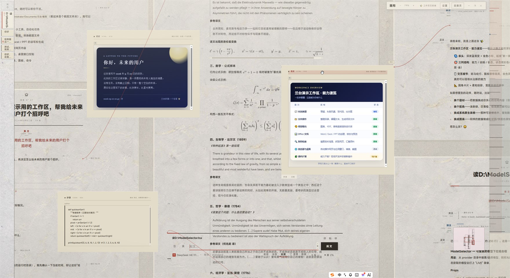
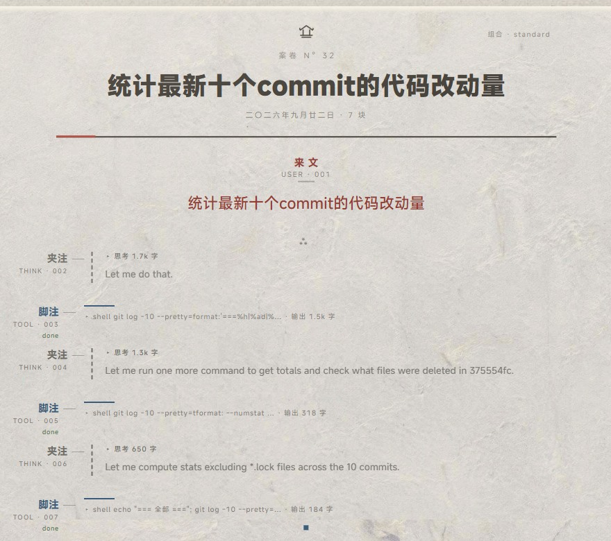

<p align="center">
  
</p>

<p align="center">
  <strong>兰台（Lantai）— 桌面 Agent 工作台</strong><br />
  主界面不是聊天窗，而是一张会生长的纸：人来文、AI 正文、思考夹注、工具脚注、代码抄录。
</p>

<p align="center">
  <a href="LICENSE"></a>
  <a href="https://github.com/834063245-creator/LantaiAgent/releases"></a>
  <a href="https://github.com/834063245-creator/LantaiAgent/actions/workflows/ci.yml"></a>
  <a href="https://whyihaveyou.github.io/dsh-suite/"></a>
</p>

<p align="center">
  
</p>

---

## 这是什么

**兰台是 Windows 桌面 Agent 工作台**（Tauri 2 壳 + TypeScript / React 19 前端）：一套完整的多 Agent 运行时。

| | |
|---|---|
| **画布，不是消息流** | 会话是一个空间：多卷摊在同一张纸上，内容可钉、可拖、可对照，缩放即改变信息粒度 |
| **多 Agent 运行时** | 域工具面 · 子 Agent 池（git worktree 隔离）· Plan / Goal · 记忆与技能 · 多厂商 Provider · token 治理 |
| **一切皆是插件** | 面板 / 命令 / 工具 / 渲染器 / prompt 段 / 钩子 / capability / 可换后端全经贡献通道装配，出厂态零特权行 |
| **护栏在壳层，不在提示词里** | 权限引擎 · 危险命令拦截 · 三层沙箱 · 加密凭据 · 权限闸审计 |
| **随包配套 HoloGram 引擎** | 代码图谱引擎是独立进程（Rust 单二进制），默认关、按工作区启用；也是可独立消费的 MCP server |

仓库里住着两个产品面：工作台（`src-ui/` + `src-tauri/`）与引擎（`engine/` 及 `hologram-*` crate）。

## 快速开始

**1. 装（Windows）**：[Releases](https://github.com/834063245-creator/LantaiAgent/releases) 下载安装包
（`.msi` / `.exe`）→ 启动。从源码：仓库根 `build.cmd`（会先跑前端构建）。

**2. 进工作区**：首次启动落在**案卷首页**——新建工作区（默认建在 `~/Documents/兰台/<名字>`），或指定一个
已有目录：一个工作区就是一张纸。

**3. 落笔**：

- 输入框写下你要它做的事，回车即成第一卷（输入 `/` 出案卷命令）。
- **侧边栏「案卷」**管本工作区的卷：＋另起一卷 · `F2` 改名 · `C` 合卷（收起，数据保留）· 删除。
- **左缘书脊**列出摊开的卷：点击定位、拖动落位、hover 合卷。书脊与侧边栏**互斥两态**（侧栏展开时书脊退场）。
- 权限卡在危险动作前弹出；Ask（默认）/ Auto（仅编辑类）/ Yolo 三档随时可切（详见[护栏](#内置-agent-工作台)）。

> **想用图谱引擎**：设置 → MCP →「随包图谱引擎」→ 勾选「启用随包图谱引擎」→ **下次打开工作区**生效
> （每工作区按各自的根起一个引擎进程，离开工作区即停）。

## 界面范式：一张会生长的纸

聊天界面把工作压成一条等权消息流：只能往下滚，多任务只能多开窗，想回到昨天那件事得靠搜索。
**纸壳 · 注疏案卷**换掉的是容器本身——会话是一个**空间**，不是一条流。

- **一个工作区 = 一张纸**：多卷（会话）摊在同一片纸上，可对照、可追溯——平行的几件事靠「多卷
  同屏」表达，而不是切窗口（运行中的卷还能同时跑，只是不能合卷）。左缘**书脊**一卷一脊、当前卷「抽出
  一半」；**合卷** = 离席但存盘，随时重新摊开。
- **位置即记忆**：任意一块能**钉成纸条**留在纸边，也能拖到流区 / 纸条区**落位**；摊开集、纸条、落位全
  落盘（`.lantai/canvas*.json`）——重启回到昨天摆好的案头，版面不用重建。
- **距离即粒度**：平移无边界、缩放 0.35–2.4 档；拉远时正文退成行影、整卷成为一眼可辨的纹路（鸟瞰），
  拉近才是字（精读），右缘**小地图**给全部摊开卷的鸟瞰。
- **注疏层级取代等权气泡**：不同来源有不同文体——**来文**（你的问话，手迹位）· **正文**（AI 的答，居中
  主角）· **夹注**（思考）· **脚注**（工具调用）· **抄录**（diff）· **程文**（程序执行）· **拟策**（审批卡）·
  **贴黄**（通知）· **错因**（回合错误）——扫一眼就知道谁在说话、哪句是结论；在来文里写【关键词】，纸面
  即渲染成朱砂圈点（人的批改）。块类型是**开放面**：内置 + Agent 资产 kind + 插件贡献。
- **回合有呼吸**：流式输出按**读包 / 写包 / 验证包 / 提交**成族，不是等距瀑布；零摊开卷时是**案头**——
  退匣直书 + 最近几卷的签条架，落笔即另起一卷。

<p align="center">
  
</p>

纸底 + 矿物墨色（朱砂＝人 / 石青＝机 / 石墨＝夹注 / 墨＝正文），自托管 MiSans 可变字体单文件；版式契约见
[`docs/design/lantai-design-spec.md`](docs/design/lantai-design-spec.md)，视觉决定账本见
[`docs/plans/paper-shell/taste-ledger.md`](docs/plans/paper-shell/taste-ledger.md)。

## 内置 Agent 工作台

**工具面**：模型只见一批高内聚域工具，每个域以 `action` 作首参——`fs(read|write|edit|…)`、
`shell(run|output|wait|kill)`、`git(status|diff|commit|…)`……；会话级另有 `Skill`、plan、通信族、
`code_execution` 执行原语（程序体在 Web Worker 沙箱里跑，可嵌套调用全部可见工具）。旧细粒度工具名已
淘汰，误调会被拦成「[已淘汰] → 域动作」。事实源 = 生成物
[`docs/agents/model-tool-contract.md`](docs/agents/model-tool-contract.md)；**跨文档标量（字段数 / 域数 /
契约版本等）见 [`docs/facts.generated.md`](docs/facts.generated.md)**，本文不复述。

**运行时**：工具行 / prompt 段 / capability 三层装配面的**表序是字节契约**，由
`npm run verify:convergence` 双轨钉死；会话变异只走 `_appendMessage` / `_replaceSession` /
`_retractSessionRange` 三个入口（`SessionLog` 支撑差分对拍、回放与审计）。规则见 [`CLAUDE.md`](CLAUDE.md) ·
[`CONVENTIONS.md`](CONVENTIONS.md) · [`INVARIANTS.md`](INVARIANTS.md)。

**多 Agent**：子 Agent 池（`fork` 继承上下文 / `fresh` 干净启动）+ 有界 inbox + 按会话隔离的 TaskBoard /
DiscoveryBoard + **git worktree 隔离执行**（`git worktree add --detach`，cherry-pick 串行合并、孤儿收养、
TTL 清理）。

**Plan / Goal**：Plan 模式只读探索 + 写计划文件，交你审批后离开，写约束由 `planGateCheck` 在执行层拦截；
Goal 模式把目标状态持久化在 `.lantai/goals/{id}/`，跨会话恢复。

**记忆与 Provider**：事件溯源会话记忆 · 项目记忆（`.lantai/memory/*.md`）· 技能
（`.lantai/skills/<name>/SKILL.md`，装完即用不必重启）；多厂商 Provider（Anthropic / OpenAI 兼容 /
DeepSeek 等，清单可运行时拉取）+ loopback 反向代理（绕开 WebView 跨域）+ 系统级加密凭据（Windows DPAPI /
macOS Keychain / Linux Secret Service）。

**护栏**：权限引擎合流系统 / 项目 / 会话规则，裁决 `Allow` / `Deny` / `Ask` / `Passthrough`（后者 = 该工具
自检无意见，中央闸按规则面放行、不弹窗），**Yolo 不旁路 Deny**；危险命令表拦 `rm -rf /`、`curl | sh`、
`eval` / `source`、`sudo`、`git push --force main` 等并对 PowerShell 特判；三层沙箱（OS 层 Windows Job
Object / macOS `sandbox-exec` / Linux `bubblewrap`——发布主力是 Windows，另两者依赖系统自带沙箱程序；shell
默认走捆绑 MSYS2 bash · 路径层越界升 Ask · I/O 层读写上限、超时、重试、原子写）；**经权限闸的调用**落
`.lantai/audit.jsonl`（pty / lsp 等无闸能力口不在其中，`code_execution` 嵌套调用落 session-log）。

## 插件系统

出厂态**没有任何一行硬编码特权**：全部贡献行（含第一方）都可被 roster patch / preset 禁用、覆盖、锚定；
另有 `manifest.mcpServers`（挂外部 MCP server，零插件代码）与 `manifest.activation`（惰性激活：登记 ≠
激活，按引用计数起停）。**贡献通道与可换后端清单以生成物
[`docs/agents/service-catalog.md`](docs/agents/service-catalog.md) 为准**。

- **最短路径**：一个 `manifest.json` + 一个自包含 ESM 模块（动态 import 装载，无包管理器、无 import map）
  → [`PLUGINS.md`](PLUGINS.md) 照着写，最快 15 分钟跑通；最小示例
  [`examples/plugins/hello/`](examples/plugins/hello/README.md)。
- **权限与信任（如实声明）**：manifest 声明 → 装载期授予门禁（一票否决）→ Rust 命令咽喉逐调用强制；
  **插件是本机全信任代码——不签名、不沙箱。**
- **契约**：[`docs/plugins/README.md`](docs/plugins/README.md) · 组合层与 preset
  [`docs/composition/README.md`](docs/composition/README.md) · 三方发布
  [`docs/user/develop/publishing-plugins.md`](docs/user/develop/publishing-plugins.md)。

## 配套引擎 HoloGram

**与兰台的关系**：引擎是**独立进程**（Rust 单二进制 `hologram-engine`）。壳只做二进制位置的**只读探测**
（`engine_assets.rs`；`LANTAI_ENGINE_EXE` 可覆盖），不链接任何引擎 crate；启用后由前端经受治进程通道拉起
（`bundled-engine.ts` → `mcp-bridge.ts` 的 ServerGovernor：懒启动 / 崩溃退避重启 / 空闲回收 / 进程树终止
→ Rust `protocol_bridge.rs` stdio）。**一进程一根**（同根幂等、异根拒绝）、**离开工作区即停**；引擎数据落
工作区根 `.hologram/`，与兰台的 `.lantai/` 分居。手动接法见
[`docs/engine-as-external-mcp.md`](docs/engine-as-external-mcp.md)。

**它能做什么**：把代码库静态解析成依赖图，让「改 A 会炸什么」变成**确定性图查询**，而不是让模型逐文件读
源码去猜：tree-sitter 语法静态链接 + 运行时 `.dll` / `.so` 动态加载；分批并行解析 → 跨文件引用 → L1–L4
耦合 → 框架路由 → 合成边 → 社区检测 → 落库（内存 CSR + SQLite / FTS5 + 语义向量，向量后端不可用时降级
n-gram）。分析后按项目语言**异步预热**原生 LSP，查询按需调用（调用解析 / 类型推断 / 实现 / 引用）；可
**导入** SCIP 索引（只消费 `index.scip`，不代跑索引器）；watcher 增量合图、失败回退全量。循环 / 脆弱模块 /
架构盲点 / 执行流 / 数据流均为**查询期**能力（不随建图预计算）。**诚实标记**：eval 与动态代码标为不可达、
动态 import 标为动态站点；结果引用了索引后又被改过的文件时带新鲜度横幅。能力面与工具清单见
[`ARCHITECTURE.md`](ARCHITECTURE.md) §5–§6 与生成物
[`docs/agents/engine-plugin-contract.md`](docs/agents/engine-plugin-contract.md)。

**三种消费形态**：① 桌面应用内——设置 → MCP →「随包图谱引擎」（默认关）；② 任意 MCP 客户端——引擎就是
标准 stdio MCP server，复制仓库根 [`.mcp.json.example`](.mcp.json.example) 为项目级 `.mcp.json`（用户级用
`claude mcp add --scope user`）；③ DSH 插件包 [`@a834063245/hologram-dsh`](dsh-bundle/README.md)——薄发布
适配层（不自带产品资产），Windows x64，装后重启 `dsh web`，图查询工具进 agent 工具箱
（`mcp__hologram__*`）。原先随包的 3D 星图已随主仓图谱渲染内核退役拆除，**包内只发引擎 + MCP 工具面**。

**引擎 CLI（从源码构建，Linux / Windows 均可）**：

```bash
cd engine && cargo build --release

hologram-engine run --list                          # 列出全部工具（两列文本）
hologram-engine run <工具> [项目根] [--key value]     # 一次性执行：结构化 JSON 出参，退出码表达结果
hologram-engine serve --project-root <项目根>         # MCP stdio 服务（加 --tcp 同时开 TCP 数据面）
```

**免编译扩展（不改 Rust）**：扩展目录（`HOLOGRAM_PLUGIN_DIR`，缺省 `<项目根>/plugins`）放 manifest 即可
声明**新语言**（扩展名表 + 查询式）、**新框架**（路由候选）、**新工具**（schema + 复用既有 handler）；
装载情况经 `engine_status.extensions` 可见，单个 manifest 失败不阻断启动。示例见
[`examples/engine-plugins/`](examples/engine-plugins/README.md)。

## 架构与目录

```
src-ui/     (TypeScript)  React 19 · 注疏案卷纸壳 · Agent 运行时 · 组合层 · Provider 体系
src-tauri/  (Rust)        Tauri 2 壳 · 权限引擎 · 沙箱 · worktree 隔离 · 审计 · 凭据 · 受治进程
engine/     (Rust)        独立二进制：解析 → 图构建 → 分析 → 存储 → stdio MCP / CLI / TCP
```

前端与壳走单一契约的 typed RPC（生成物
[`docs/agents/frontend-rpc-contract.md`](docs/agents/frontend-rpc-contract.md)）；壳与引擎**无进程内依赖**。
分层、数据流与关键决策见 [`ARCHITECTURE.md`](ARCHITECTURE.md)；四条最高架构约定见
[`docs/adr/project-constitution.md`](docs/adr/project-constitution.md)。

## 文档地图

| 我想…… | 去哪 |
|---|---|
| 知道「现在做到哪、还剩什么」 | [`docs/plans/README.md`](docs/plans/README.md)（时间轴 [`HISTORY.md`](docs/plans/HISTORY.md)） |
| 写插件 / 换后端 | [`PLUGINS.md`](PLUGINS.md) → [`docs/plugins/README.md`](docs/plugins/README.md) → [`docs/cookbook/`](docs/cookbook/README.md) |
| 查数字真源 / 模型可见工具面 | [`docs/facts.generated.md`](docs/facts.generated.md) · [`docs/agents/model-tool-contract.md`](docs/agents/model-tool-contract.md) |
| 改代码前看规则 / 雷区 | [`CLAUDE.md`](CLAUDE.md) · [`CONVENTIONS.md`](CONVENTIONS.md) · [`INVARIANTS.md`](INVARIANTS.md) · [`docs/landmine-map.md`](docs/landmine-map.md) |
| 全部文档索引（按任务 / 按角色） | [`docs/README.md`](docs/README.md)（`docs/archive/` 是历史，不是现状） |

## 开发与门禁

```bash
dev.cmd                                  # 开发窗：Vite HMR @127.0.0.1:1420，改前端保存即生效
build.cmd                                # 桌面安装包（等价 cd src-tauri && cargo tauri build）

cd engine && cargo test                  # 引擎用例
cd src-tauri && cargo test               # 壳用例（权限 / 生命周期 / 隔离）
cd src-ui && npx vitest run              # 前端用例（本机跑前先 $env:NODE_ENV='test'）
cd src-ui && npm run build               # tsc --noEmit + vite build
cd src-ui && npm run verify:convergence  # Agent 运行时契约门禁（standard + minimal 双轨）
cd src-ui && npm run doc-check           # 文档面门禁
```

**门禁不过不 commit。** 基线数字会漂移，以重新实测为准（基线值与运行纪律见
[`CONVENTIONS.md`](CONVENTIONS.md) §3）。提交流程见 [`CONTRIBUTING.md`](CONTRIBUTING.md)；开工前必读
[`CLAUDE.md`](CLAUDE.md)（唯一权威规则文件）与 [`AGENTS.md`](AGENTS.md)（薄指针）。

## 许可

兰台（Lantai）© 2026 Wenbing Jing — [MIT](LICENSE)。第三方组件版权声明见
[THIRD_PARTY_NOTICES.md](THIRD_PARTY_NOTICES.md)；安全策略见 [SECURITY.md](SECURITY.md)。
